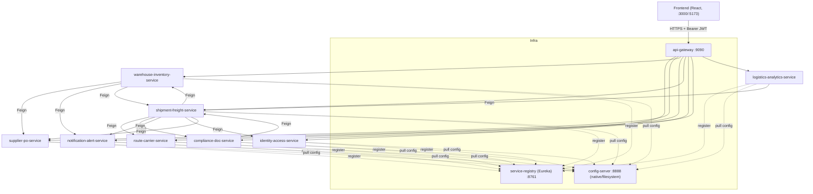
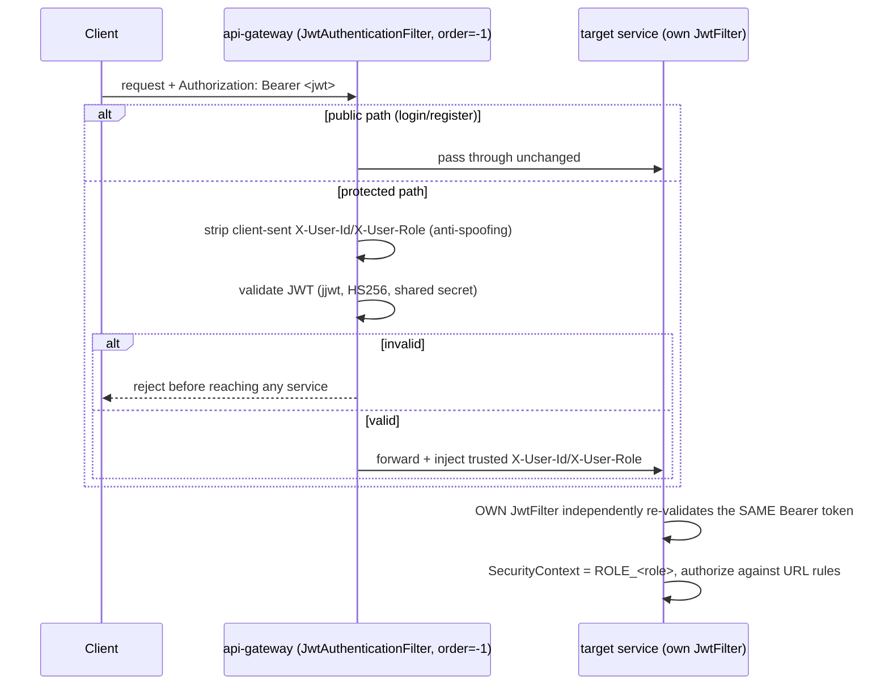
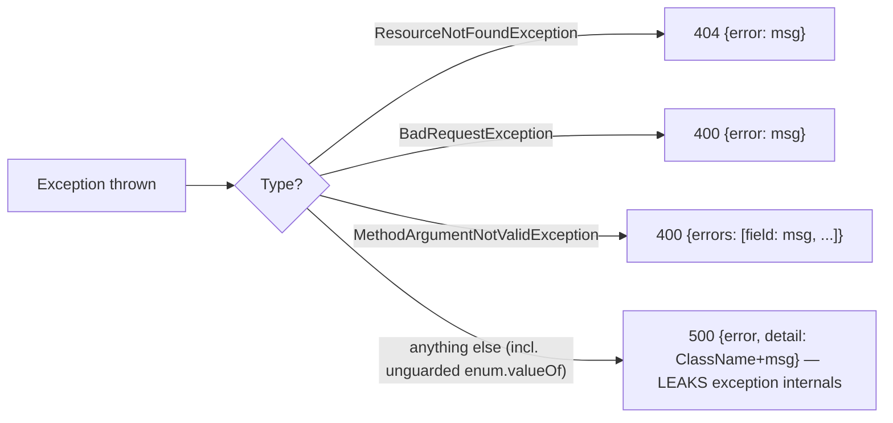
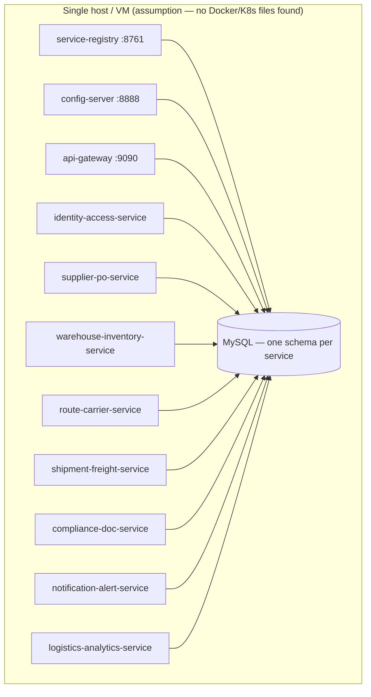

# Logi Track — Microservices Documentation

> **Domain:** Logistics / supply-chain platform (assumption — inferred from domain vocabulary: shipments, freight orders, carriers, warehouses, purchase orders; no explicit business-domain label found in code/config). **Stack (confirmed in code, not assumed):** Java **17** (root `pom.xml` — note: earlier framing assumed 21, corrected here), Spring Boot **3.2.3**, Spring Cloud **2023.0.0**, MySQL, Spring Security + JJWT (HS256), REST, Eureka (service discovery), Spring Cloud Config Server (`native` profile, filesystem-backed). **No message broker** (no Kafka/RabbitMQ/Azure Service Bus anywhere in the codebase) and **no cache layer** (no Redis, no `@Cacheable`) — confirmed by repo-wide search. **Deployment:** no Docker/Kubernetes manifests exist anywhere — inferred to be manual/VM-based (assumption).

This documentation set was generated by reading the actual source code of all 11 modules (via parallel research passes, cross-checked against the config-repo). Depth is **file-by-file + key-method**, not literal line-by-line for every statement — chosen deliberately to keep 11 modules' worth of documentation both thorough and usable in one pass.

## How to use this documentation

- **New to the codebase?** Start with this README's system overview, then read the service you're working on.
- **Debugging a production issue?** Jump to that service's doc, §I (Production-Readiness Review) — every known bug/gap is cataloged there with the exact symptom.
- **Preparing for an interview?** Every service doc ends with §J (Interview Preparation) — real Q&A grounded in this actual codebase, not generic microservices trivia.
- **Doing a design review?** This README's §"Platform-wide risk themes" collects patterns that repeat across services (the same bug shape appearing in 4+ places is a training/tooling gap, not a one-off).

## Module index

| Module | Doc | One-line role |
|---|---|---|
| service-registry, config-server, api-gateway | [infrastructure.md](infrastructure.md) | Service discovery, centralized config, single public entry point + JWT edge validation |
| identity-access-service | [identity-access-service.md](identity-access-service.md) | User accounts, login, JWT issuance, audit log (write-only — no read API) |
| supplier-po-service | [supplier-po-service.md](supplier-po-service.md) | Suppliers + Purchase Orders |
| route-carrier-service | [route-carrier-service.md](route-carrier-service.md) | Routes, Carriers, Rate Cards (incl. the combined-search fix) |
| warehouse-inventory-service | [warehouse-inventory-service.md](warehouse-inventory-service.md) | Warehouse stock, Inbound Receipts, Pick Lists |
| shipment-freight-service | [shipment-freight-service.md](shipment-freight-service.md) | Shipments, Freight Orders, Delivery Events — the platform's most-connected hub |
| compliance-doc-service | [compliance-doc-service.md](compliance-doc-service.md) | Shipment Documents (incl. real file upload), Compliance Flags |
| notification-alert-service | [notification-alert-service.md](notification-alert-service.md) | In-app notification inbox (no email/SMS/push) |
| logistics-analytics-service | [logistics-analytics-service.md](logistics-analytics-service.md) | Computed shipment-performance reports |

---

## System context

**Reading this diagram:** `shipment-freight-service` is the hub — it calls out to 6 of the other 7 business services and is itself called by 2. Every other business service is either a pure leaf (supplier-po-service, route-carrier-service, identity-access-service, notification-alert-service — no outbound Feign calls despite most declaring the dependency) or a thin consumer (compliance-doc-service, logistics-analytics-service, warehouse-inventory-service each call 1–3 others).

## Service dependency map (who calls whom via Feign)

| Caller | Calls | Purpose |
|---|---|---|
| shipment-freight-service | route-carrier-service | Route/Carrier/RateCard lookups for shipment creation |
| shipment-freight-service | warehouse-inventory-service | Pick-list completion check before dispatch |
| shipment-freight-service | compliance-doc-service | Pending-documents & open-flags checks before dispatch |
| shipment-freight-service | notification-alert-service | Notify shipper/driver on dispatch/delivery/delay |
| shipment-freight-service | identity-access-service | Validate shipper exists on freight-order creation |
| shipment-freight-service | supplier-po-service | Validate optional PO reference on freight-order creation |
| compliance-doc-service | shipment-freight-service | Validate `shipmentId` exists before creating a document/flag |
| logistics-analytics-service | shipment-freight-service | Fetch all shipments to compute report metrics |
| warehouse-inventory-service | supplier-po-service | Fetch PO line items on inbound-receipt RECEIVED transition |
| warehouse-inventory-service | notification-alert-service | Notify on pick-list create/assign |
| warehouse-inventory-service | shipment-freight-service | Validate freight order exists on pick-list creation |

**Services with zero outbound Feign calls** (confirmed, despite most declaring the OpenFeign dependency): `identity-access-service`, `supplier-po-service`, `route-carrier-service`, `notification-alert-service`.

## Authentication flow (platform-wide)

Only `identity-access-service` **issues** tokens (`POST /api/auth/login`). Every service — including the gateway — independently **validates** them with the same shared HS256 secret (defense in depth, at the cost of 9+ duplicated copies of the same secret in plaintext config).

## Error-handling flow (platform-wide pattern)

Every business service follows the identical `@RestControllerAdvice` shape:

This exact pattern — including the **same class of bug** (unguarded `Enum.valueOf(queryParam)` producing a `500` instead of a `400`) — recurs in supplier-po-service, identity-access-service, route-carrier-service, warehouse-inventory-service, and compliance-doc-service. This is almost certainly copy-pasted boilerplate from a shared template, which is good for consistency but means the fix, once found, should be applied everywhere at once (see below).

## Deployment architecture (as inferred — no manifests exist)

Boot order (manual, no orchestration tooling found): `service-registry` → `config-server` → everything else. Every business service's `spring.config.import: configserver:http://localhost:8888` is a **hard startup dependency** — if config-server isn't up first, no other service can start.

---

## Platform-wide risk themes

These patterns repeat across 3+ services, meaning they're systemic (a shared template or convention), not isolated mistakes:

1. **Unguarded `Enum.valueOf(queryParam)` in status-update endpoints** → an invalid client value becomes a `500 Internal Server Error` instead of a clean `400`. Found in: supplier-po-service (both `PATCH`s), identity-access-service, route-carrier-service (3 controllers), warehouse-inventory-service (2 controllers), compliance-doc-service. **Fix once, apply everywhere:** wrap the parse and translate `IllegalArgumentException` → `BadRequestException`.
2. **Plaintext secrets in `config-repo`** — the same JWT HMAC secret is duplicated across every service's YAML (and MySQL root credentials in at least identity-access-service). No vault/KMS indirection anywhere.
3. **"Create" endpoints silently discard client-supplied `status`** — every entity's create path hardcodes its initial status (ACTIVE/DRAFT/PENDING/OPEN/UNREAD) regardless of what the DTO carries. Consistent behavior, but no service tells the caller their `status` field was ignored.
4. **No status state-machines anywhere** — every `PATCH .../status` endpoint across every service accepts any-value-to-any-value transitions with zero validation (the one exception: `FreightOrderServiceImpl.cancelOrder` blocks cancelling a `DELIVERED` order).
5. **Inconsistent Feign failure handling** — some callers fail closed (block the operation), some fail open (empty catch, assume success), sometimes both within the same method (`shipment-freight-service.dispatchShipment`'s 4 gates are the starkest example — see that service's doc §A).
6. **Declared-but-unused OpenFeign + Resilience4j dependencies** — present in nearly every `pom.xml` and pre-configured in `config-repo/*.yml`, but only genuinely wired with `@CircuitBreaker`/`feign.circuitbreaker.enabled=true` in `shipment-freight-service`. Everywhere else it's dead weight.
7. **Dead repository query methods** — nearly every service has 1–4 `findBy...` methods declared and never called. Harmless, but a maintainability smell (unclear if they're vestigial or half-finished features).
8. **Inconsistent exception-type choice for "not found" on create-time FK lookups** — some services throw `ResourceNotFoundException` (404), others `BadRequestException` (400), for the conceptually identical "the referenced ID doesn't exist" situation, sometimes within the *same* service (route-carrier-service's `addRateCard` vs. its own `findEntity` helpers).
9. **No hard deletes anywhere in the platform** — every "delete" operation across every service is a soft-delete status flip, never a physical row removal. This is a deliberate, consistently-applied convention (unlike the inconsistencies above).

---

## Interview preparation — system-level questions

**Q: Describe the overall architecture in 2 minutes.**
A: A Spring Cloud microservices platform — Eureka for discovery, a Config Server serving centralized YAML from a local filesystem repo, and an API Gateway as the single public entry point that validates JWTs at the edge before routing to 8 business services by path. Each business service owns its own MySQL schema and validates the same JWT independently (defense in depth). There's no message broker — all inter-service communication is synchronous REST via Feign, and no cache layer — every read hits the database directly. `shipment-freight-service` is the domain hub, calling into 6 of the other 7 services.

**Q: Why no message broker? What would you gain by adding one?**
A: As built, every cross-service side-effect (notifications, inventory sync, dispatch gates) is a synchronous Feign call with per-caller, inconsistent failure handling. An event broker (Kafka/RabbitMQ) would let services publish domain events (`ShipmentDispatched`, `ReceiptReceived`) and have consumers react asynchronously and independently — removing the tight coupling where, e.g., `shipment-freight-service` must synchronously reach 4 other services just to dispatch one shipment, and eliminating the fail-open/fail-closed inconsistency by making failure handling (retry, DLQ) a platform-level concern instead of ad hoc per-caller code.

**Q: What's the single biggest cross-cutting risk in this platform?**
A: The combination of (a) a shared JWT secret in plaintext across every service's config, and (b) a completely unauthenticated config-server that serves those files to anyone who can reach port 8888 — compromising that one port compromises every service's token-signing trust platform-wide. A close second: the inconsistent Feign-failure-handling patterns, especially `shipment-freight-service`'s dispatch gates, where a downstream outage can silently bypass a compliance check rather than blocking the operation.

**Q: If you had to scale this platform 10x in traffic, what would break first?**
A: No cache layer means every read (including `logistics-analytics-service` fetching **every** shipment on every report generation, and `getSummary()`'s in-memory "find latest report" via `findAll()`) hits MySQL directly and gets more expensive as tables grow. The synchronous, no-broker, no-circuit-breaker (in 7 of 8 services) architecture also means a slow/down dependency directly slows or fails its callers, with no bulkheading beyond the one service that actually wired up `feign.circuitbreaker.enabled=true`.
