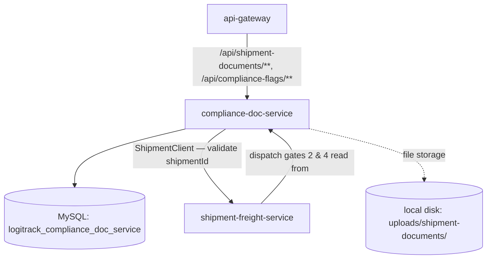
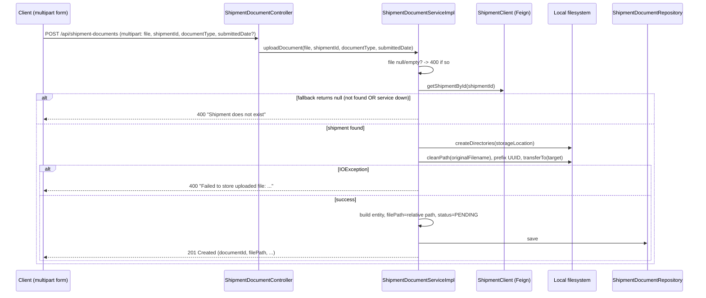
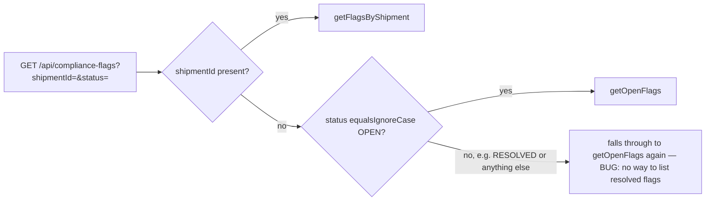

# compliance-doc-service — Technical Documentation

> Java 17, Spring Boot 3.2.3, MySQL, JWT-secured REST. Owns **Shipment Documents** (BOL, invoices, etc. — including the newly-added real file-upload capability) and **Compliance Flags**. Calls out to `shipment-freight-service` to validate that a `shipmentId` is real before attaching a document or flag to it.

---

## A. Executive Summary

**30-second version:** This service records the paperwork (bills of lading, customs declarations, etc.) and compliance issues attached to a shipment. It recently gained real file-upload support — documents can now be created either via a legacy JSON metadata-only POST, or via a genuine `multipart/form-data` POST that stores the file on disk and persists a relative path.

**2-minute version:** `ShipmentDocumentController` exposes **two POST endpoints on the same path**, dispatched by `consumes` media type: `application/json` (legacy, metadata-only — the entity's `filePath` is whatever string the client sends, no file actually exists) and `multipart/form-data` (real upload — `storeFile()` sanitizes the filename via `StringUtils.cleanPath`, prefixes it with a `UUID` to avoid collisions, writes it under a configurable `document.storage.location` directory, default `uploads/shipment-documents`, and returns a forward-slash-normalized relative path). Both paths call a shared `validateShipmentExists` helper against a Feign `ShipmentClient` — but `ComplianceFlagServiceImpl.raiseFlag` duplicates similar logic independently, with **less robust error handling** (no broad catch, so an unexpected Feign exception there would surface as an uncaught `500` instead of the document service's clean `400`).

**Detailed technical explanation:** Neither `ShipmentDocument` nor `ComplianceFlag` has a JPA relationship to `Shipment` — `shipmentId` is a bare integer validated only at write-time via Feign, never re-checked afterward. `ComplianceFlagController.get()` has an unreachable branch: its `status` handling only recognizes `"OPEN"` case-insensitively; anything else (including `"RESOLVED"`, which has a fully-implemented `getResolvedFlags()` service method) falls through to the same `getOpenFlags()` default — meaning **there is no way to list resolved flags** despite the capability existing in the service layer. `DocumentStatus.SUBMITTED` is defined but never assigned by any code path. The Feign fallback (`ShipmentClientFallbackFactory`) returns `null` for a single lookup and an empty list for "all shipments" — meaning a downed `shipment-freight-service` and a genuinely-nonexistent `shipmentId` are **indistinguishable** to the caller (both produce the same 400).

**Business explanation:** Before a shipment can dispatch, someone needs to confirm the right documents exist and there are no unresolved compliance issues (this is exactly what `shipment-freight-service`'s dispatch gates check, via Feign, against this service). A compliance officer raises a flag when something's wrong (customs paperwork missing, a regulatory concern) and resolves it once addressed.

---

## B. Business Context

**Business capability:** Shipment document management + compliance issue tracking.

**Actors:** `COMPLIANCE`, `ADMIN` — the only two roles with access to any endpoint in this service.

**Upstream systems:** None call this service via Feign (confirmed — only the API Gateway routes to it from the frontend).

**Downstream systems:** `shipment-freight-service` (via `ShipmentClient`, to validate `shipmentId` exists before creating a document or flag).

**Business impact if unavailable:** No new shipment documents or compliance flags can be recorded; more importantly, `shipment-freight-service`'s dispatch gates 2 (pending documents) and 4 (open flags) — which call **into** this service — would hit their fail-open catch blocks and silently assume "no pending documents"/"no open flags," letting shipments dispatch without a real compliance check (see shipment-freight-service.md §I).

### Use case: Upload a shipment document (the new file-upload flow)
1. **Actor:** COMPLIANCE or ADMIN.
2. **Trigger:** `POST /api/shipment-documents` with `Content-Type: multipart/form-data`.
3. **Preconditions:** a file is selected; `shipmentId` references a real shipment (checked via Feign).
4. **Main flow:** file validated non-empty → shipment existence validated → file written to `document.storage.location` with a UUID-prefixed sanitized name → relative path persisted → `status` forced `PENDING`.
5. **Failure flow:** no file selected → `400`; shipment doesn't exist (or the Feign call to check it fails) → `400`; disk write fails (`IOException`) → `400` wrapping the I/O error.
6. **Business result:** the actual document file now exists on the server's filesystem, referenced by a stable relative path in the database — no more "file path as a trust-me string" from the legacy JSON path.

### Use case: Raise and resolve a compliance flag
1. **Actor:** COMPLIANCE or ADMIN.
2. **Trigger:** `POST /api/compliance-flags`, later `PATCH /{id}/resolve`.
3. **Main flow:** shipment existence checked (Feign); flag created with `status=OPEN`, `raisedDate` auto-stamped; resolve sets `status=RESOLVED` (idempotent — no guard against resolving an already-resolved flag).
4. **Business result:** the flag is now visible to `shipment-freight-service`'s dispatch gate 4 — but only while it's `OPEN`; there's no API to list historically resolved flags (see §I).

---

## C. Repository Structure (annotated)

```
compliance-doc-service/src/main/java/com/cognizant/logitrack/
├── entity/
│   ├── ShipmentDocument.java        # shipmentId(plain int), documentType, filePath(length=500),
│   │                                 #  submittedDate, status(PENDING default)
│   └── ComplianceFlag.java          # shipmentId(plain int), flagType(free text), severity, raisedDate(@CreationTimestamp),
│                                     #  status(OPEN default)
├── enums/
│   ├── DocumentType.java             # BOL, COMMERCIALINVOICE, PACKINGLIST, CUSTOMSDECLARATION
│   ├── DocumentStatus.java           # PENDING, SUBMITTED(never assigned), APPROVED, REJECTED
│   ├── FlagSeverity.java             # LOW, MEDIUM, HIGH
│   └── FlagStatus.java               # OPEN, RESOLVED
├── dto/ (ShipmentDocumentDTO, ComplianceFlagDTO, ShipmentDTO — Feign response mirror)
├── controller/
│   ├── ShipmentDocumentController.java  # TWO POST endpoints (JSON legacy + multipart new), GET, PATCH status
│   └── ComplianceFlagController.java    # POST, GET (buggy status branch), PATCH resolve
├── service/ + serviceImplementation/
│   ├── ShipmentDocumentService(Impl).java   # uploadDocument (2 overloads), storeFile(), validateShipmentExists()
│   └── ComplianceFlagService(Impl).java     # raiseFlag (duplicated, less-robust validation), resolveFlag
├── repository/ (ShipmentDocumentRepository, ComplianceFlagRepository — findByDocumentType/findBySeverity unused)
├── client/
│   ├── ShipmentClient.java              # -> shipment-freight-service, fallbackFactory
│   └── ShipmentClientFallbackFactory.java  # returns null / emptyList on failure
├── exception/ (BadRequestException, ResourceNotFoundException, GlobalExceptionHandler)
└── config/SecurityConfig.java + FeignClientInterceptor.java + security/JwtFilter.java, JwtUtil.java
```

Config: `config-repo/compliance-doc-service.yml` — `document.storage.location: uploads/shipment-documents` (a **relative** path, resolved against the JVM's working directory at runtime), multipart size limits (`max-file-size: 10MB`, `max-request-size: 15MB`), Resilience4j default instance (not confirmed bound to `ShipmentClient` — no `feign.circuitbreaker.enabled=true` found in this service's config, unlike shipment-freight-service).

---

## D. Architecture







---

## E. Startup & Runtime Lifecycle

Standard platform pattern — see `infrastructure.md` §E. One service-specific detail: `@Value("${document.storage.location:uploads/shipment-documents}")` is resolved at bean-construction time from the config fetched at startup; the directory itself is created lazily on first upload (`Files.createDirectories`), not at startup.

---

## F. API Documentation

### `POST /api/shipment-documents` (consumes `application/json`) — COMPLIANCE/ADMIN
Legacy metadata-only path. **Request (`ShipmentDocumentDTO`):** `shipmentId` `@NotNull`, `documentType` `@NotNull`, `filePath` (free string, trusted as-is — no file actually verified to exist), `submittedDate`, `status` (ignored, forced `PENDING`).

### `POST /api/shipment-documents` (consumes `multipart/form-data`) — COMPLIANCE/ADMIN
**The new real upload.** Params: `file` (MultipartFile, required), `shipmentId` (required), `documentType` (required), `submittedDate` (optional, `@DateTimeFormat(ISO.DATE)`). Both POSTs coexist on the same path, dispatched purely by `consumes`.

```json
// Sample response (201) for the multipart path
{ "documentId": 88, "shipmentId": 900, "documentType": "BOL",
  "filePath": "uploads/shipment-documents/3f2a1c9e-...-bol-900.pdf",
  "submittedDate": "2026-07-28", "status": "PENDING" }
```

### `GET /api/shipment-documents?shipmentId=` — COMPLIANCE/ADMIN

### `PATCH /api/shipment-documents/{id}/status?status=` — COMPLIANCE/ADMIN
**Bug:** `DocumentStatus.valueOf(status)` parsed inline with no guard — invalid value → uncaught `IllegalArgumentException` → `500` instead of `400`.

### `POST /api/compliance-flags` — COMPLIANCE/ADMIN
**Request (`ComplianceFlagDTO`):** `shipmentId` `@NotNull`, `severity` `@NotNull`, `flagType` (free string, **no `@Size` despite the entity's `length=100` column** — a value longer than 100 chars would fail at the DB layer with a truncation/constraint error, not a clean `400`). Forces `status=OPEN`, `raisedDate` auto-stamped.

### `GET /api/compliance-flags?shipmentId=&status=` — COMPLIANCE/ADMIN
See the bug in §D — `status=RESOLVED` (or anything other than `OPEN`) silently returns open flags instead, despite `getResolvedFlags()` existing and working in the service layer.

### `PATCH /api/compliance-flags/{id}/resolve` — COMPLIANCE/ADMIN
Sets `status=RESOLVED`; idempotent (no error if already resolved).

---

## G. End-to-End Request Flow — `POST /api/shipment-documents` (multipart)

1. Request via gateway, `/api/shipment-documents/**` predicate; JWT validated; role check requires `COMPLIANCE`/`ADMIN`.
2. Spring resolves the `multipart/form-data` overload (by `consumes`), binds `file`/`shipmentId`/`documentType`/`submittedDate` as individual `@RequestParam`s (no DTO deserialization involved on this path).
3. `ShipmentDocumentServiceImpl.uploadDocument(file, shipmentId, documentType, submittedDate)`: guards `file==null || file.isEmpty()` → `BadRequestException`.
4. `validateShipmentExists(shipmentId)` calls `ShipmentClient.getShipmentById` — if the Feign fallback triggers (service down or genuinely not found) it returns `null`, translated to `BadRequestException("Shipment does not exist")`; any other exception is caught broadly and rewrapped as `BadRequestException("Invalid or unavailable shipmentId: " + shipmentId)`.
5. `storeFile(file)`: creates the storage directory if missing, sanitizes the original filename (`StringUtils.cleanPath`, blocking path-traversal sequences), prefixes a `UUID`, writes via `file.transferTo(...)`, returns a forward-slash-normalized relative path.
6. Entity built with that path, `status` forced `PENDING`, saved.
7. Response mapped to `ShipmentDocumentDTO`, `201 Created`.
8. **Failure branches:** no file → `400`; shipment not found/service down → `400` (indistinguishable); `IOException` during write → `400` wrapping the I/O message.

---

## H. File-by-File Documentation (key files)

### `serviceImplementation/ShipmentDocumentServiceImpl.java`
The two `uploadDocument` overloads (JSON vs multipart) share `validateShipmentExists` (a genuinely reusable, well-guarded helper — broad catch, consistent error translation). `storeFile` — the actual disk-write logic: `Files.createDirectories`, `StringUtils.cleanPath` sanitization, `UUID`-prefixed filename, `file.transferTo`, forward-slash path normalization, `IOException` → `BadRequestException`.

### `serviceImplementation/ComplianceFlagServiceImpl.java`
`raiseFlag` **duplicates** the shipment-existence-check logic from the document service rather than reusing a shared helper, and is **less robust**: it only null-checks the Feign result (no broad `catch (Exception e)`), so an unexpected runtime exception from the Feign call would propagate uncaught to the generic 500 handler, unlike the document service's guaranteed-400 behavior for the same conceptual failure.

### `controller/ComplianceFlagController.java`
The buggy `get()` method — `status` handling only recognizes `"OPEN"`; everything else (including `"RESOLVED"`) falls through to the same default. `getResolvedFlags()` is fully implemented on the service/interface but has **zero route ever calling it**.

### `client/ShipmentClientFallbackFactory.java`
Logs at `ERROR` and returns `null` (single lookup) / `Collections.emptyList()` (all-shipments) — the mechanism by which a downed `shipment-freight-service` becomes indistinguishable from "shipment genuinely doesn't exist" to every caller in this service.

---

## I. Production-Readiness Review

| Dimension | Finding |
|---|---|
| **Missing feature (confirmed dead capability)** | `getResolvedFlags()` is fully implemented but unreachable — no route ever calls it, despite `ComplianceFlagController.get()` clearly intending to branch on `status`. |
| **Duplicated, inconsistent validation** | Shipment-existence checking is implemented twice (document service: robust, broad catch; flag service: narrower, less robust) instead of shared. |
| **Ambiguous failure semantics** | "Shipment not found" and "shipment-freight-service is down" produce the identical `400` response — a caller/ops engineer can't tell the difference from the API alone. |
| **Correctness bug** | Unguarded `DocumentStatus.valueOf` in the status-update endpoint → `500` instead of `400`. |
| **Validation gap** | `ComplianceFlagDTO.flagType` has no `@Size` despite the entity column being `length=100` — a long value fails at the DB layer, not cleanly at the API boundary. |
| **Dead enum value** | `DocumentStatus.SUBMITTED` is never assigned anywhere. |
| **Response-shape inconsistency** | Error bodies vary between `{"error": ...}`, `{"errors": [...]}`, and `{"error", "detail"}` across different exception types (platform-wide pattern, not unique to this service). |
| **Relative storage path** | `document.storage.location` defaults to a relative path — resolved against whatever the JVM's working directory happens to be at runtime, not a fixed absolute location; worth hardening for production deployment. |
| **Testing** | Not deeply assessed in this research pass; no test evidence surfaced. |

---

## J. Interview Preparation

**Q: Walk me through how the new file-upload endpoint avoids overwriting files with the same name.**
A: `storeFile()` sanitizes the client-supplied original filename with `StringUtils.cleanPath` (stripping path-traversal sequences like `../`), then prefixes it with a freshly-generated `UUID` before writing to disk — so two uploads of `invoice.pdf` become two distinct files (`<uuid1>_invoice.pdf`, `<uuid2>_invoice.pdf`), and the original name is preserved as a human-readable suffix for reference.

**Q: Why can't the compliance-flags GET endpoint return resolved flags, and how would you fix it?**
A: The controller's `status` branching only checks for `"OPEN"` (case-insensitive); any other value — including the natural `"RESOLVED"` a caller would try — falls through to the same `getOpenFlags()` call as the "no status given" default. The service layer already has a working `getResolvedFlags()` method; the fix is simply adding an `else if ("RESOLVED".equalsIgnoreCase(status))` branch in the controller to call it.

**Q: What's the risk of the Feign fallback returning `null` for "shipment not found or service down"?**
A: It removes the caller's ability to distinguish a genuine data-validation failure (bad `shipmentId`, reject the request permanently) from a transient infrastructure failure (retry later). Both currently produce the same `400 "Shipment does not exist"`, which could mislead an API consumer or support engineer investigating what looks like bad client input when it's actually a downstream outage.
