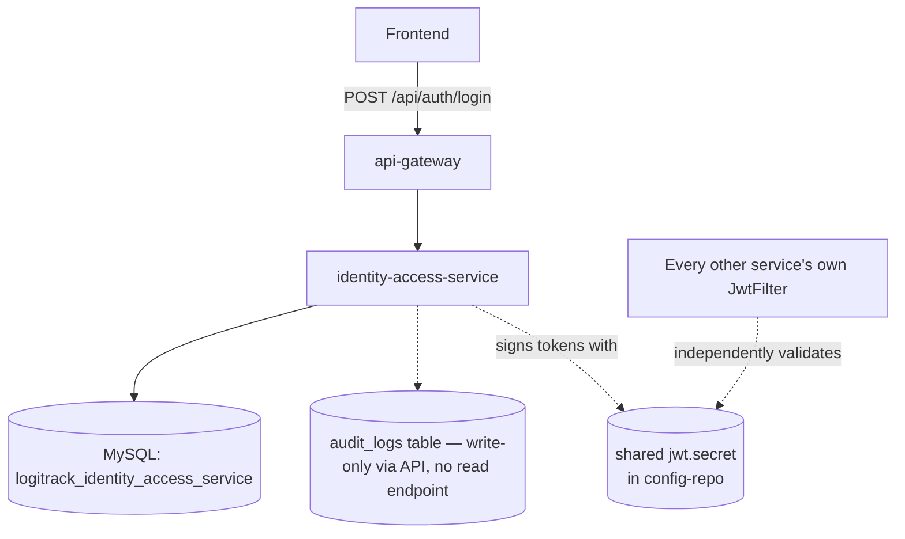
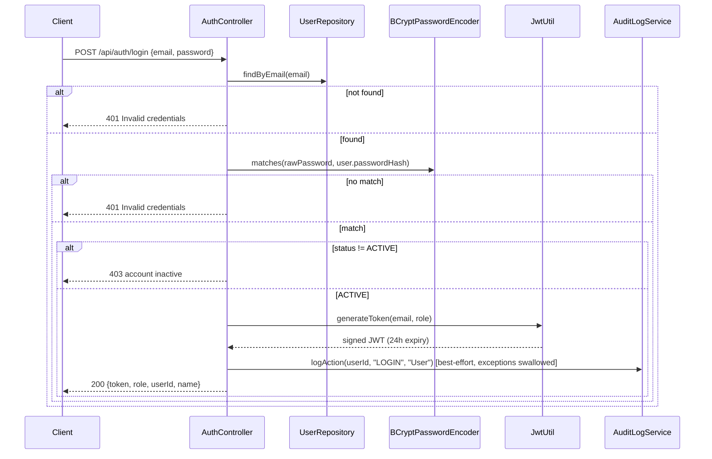
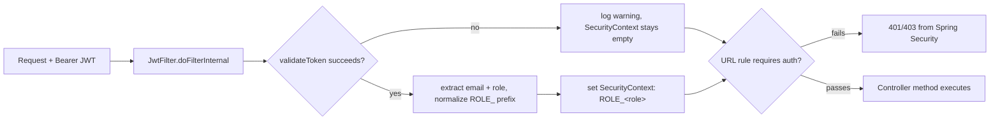

# identity-access-service — Technical Documentation

> Java 17, Spring Boot 3.2.3, MySQL, JWT (HS256), REST. This is the **trust root** of the platform — every other service validates JWTs signed with the same secret this service uses to issue them.

---

## A. Executive Summary

**30-second version:** This service owns user accounts and authentication. It issues JWTs on login, lets an ADMIN provision new users (no self-service signup), and records an audit trail of login/create/status-change/delete actions — though nothing ever reads that audit trail back out via the API.

**2-minute version:** Two entities: `User` (with a `Role` enum shared platform-wide and a soft-delete `status`) and `AuditLog` (`@ManyToOne` to `User`). `POST /api/auth/login` checks BCrypt-hashed credentials, rejects `INACTIVE` accounts with a `403`, and returns a JWT (24h expiry, HS256, secret from `config-repo`) plus role/userId/name. `POST /api/auth/register` and all of `/api/users/**` are ADMIN-only — there is no public signup. Every user action (`createUser`, `updateUserStatus`, `deleteUser`) writes a best-effort audit log entry (`AuditLogService.logAction`, exceptions swallowed so audit failures never break the main operation) — but **no controller ever exposes a way to read audit logs**, despite `SecurityConfig` reserving a `GET /api/audit-logs/**` rule for ANALYST/ADMIN that has no matching controller.

**Detailed technical explanation:** `AuthController.login` doesn't use `@Valid` on `LoginRequestDTO` (which has no validation annotations at all), so a null/blank email reaches the repository lookup directly rather than failing fast. `JwtUtil.generateToken` signs `sub=email`, custom claim `role`, `iat`/`exp` with `SignatureAlgorithm.HS256` via `Keys.hmacShaKeyFor`. `JwtFilter` (a custom `OncePerRequestFilter`) parses the Bearer token, normalizes a possible double `ROLE_` prefix, and sets a single-authority `SecurityContext` — any parse failure is logged and swallowed, letting the request fall through to be rejected by the URL-based authorization rules rather than the filter itself returning 401. `deleteUser` is a soft delete (`status=INACTIVE`), never a row removal.

**Business explanation:** This is how the platform knows who you are and what you're allowed to do. An administrator creates accounts (drivers, coordinators, compliance officers, etc.) with a specific role; that role becomes a JWT claim every other service trusts to decide what you can touch. Deactivating a user (soft delete) revokes their ability to log in again (checked at login time) without erasing their history.

---

## B. Business Context

**Business capability:** Identity, authentication, and coarse-grained role assignment for the whole platform.

**Actors:** `ADMIN` (the only role that can create/manage other users), and every other role (`SHIPPER, COORDINATOR, WAREHOUSEOPS, DRIVER, COMPLIANCE, ANALYST`) as a login-only consumer.

**Upstream systems:** None call in (this is the root of trust, not a consumer of anything).

**Downstream systems:** Every other business service independently validates the JWT this service issues (same shared secret). Nothing was found to call `identity-access-service` via Feign (confirmed — no `@FeignClient` targeting it exists in the codebase; `@EnableFeignClients` is declared but unused here). Note: `shipment-freight-service` has an `IdentityClient` that calls `getUserById` on this service (see shipment-freight-service.md) — so it **is** consumed via Feign by at least one other service.

**Business impact if unavailable:** Nobody can log in (existing JWTs remain valid until they expire — up to 24 hours — since validation is stateless and doesn't call back to this service), and no new users can be provisioned. This is a platform-wide authentication outage risk once existing tokens expire.

### Use case: Administrator provisions a new user
1. **Actor:** ADMIN (must already be authenticated).
2. **Trigger:** `POST /api/auth/register` (ADMIN-only, not self-service).
3. **Preconditions:** Caller holds an ADMIN JWT; email not already registered.
4. **Main flow:** `name`/`email`/`password`/`role` required; email uniqueness checked (`existsByEmail`); password BCrypt-hashed; `status` forced `ACTIVE`; audit action `USER_CREATED` written (best-effort).
5. **Failure flow:** Duplicate email → `400`. Missing required field → `400` (bean validation).
6. **Business result:** A new platform account exists with a specific role, ready to log in.
7. **Audit implications:** One `AuditLog` row (`action=USER_CREATED`), if the audit write itself doesn't fail (silently ignored if it does).

### Use case: User logs in
1. **Actor:** any user with valid credentials.
2. **Trigger:** `POST /api/auth/login` (public, no auth required).
3. **Preconditions:** account must exist and be `ACTIVE`.
4. **Main flow:** email looked up, BCrypt match checked, JWT issued (24h expiry), audit action `LOGIN` written best-effort.
5. **Failure flow:** wrong credentials or unknown email → `401`. Account exists but `INACTIVE` → `403` with a specific message.
6. **Business result:** caller receives a bearer token usable across the entire platform.

### Use case: Deactivate a user
1. **Actor:** ADMIN.
2. **Trigger:** `DELETE /api/users/{id}` (soft delete) or `PATCH /api/users/{id}?status=INACTIVE`.
3. **Main flow:** `status` set to `INACTIVE`, row never removed, audit action written.
4. **Business result:** the user can no longer log in (checked at `login` time), but their historical records (audit logs, anything referencing their `userId` elsewhere) remain intact.

---

## C. Repository Structure (annotated)

```
identity-access-service/
└── src/main/java/com/cognizant/logitrack/
    ├── IdentityAccessApplication.java   # @SpringBootApplication + @EnableFeignClients (unused — no
    │                                     #  @FeignClient defined in THIS module; other services call in)
    ├── entity/
    │   ├── User.java                    # table `users`; email unique; status defaults ACTIVE
    │   └── AuditLog.java                # table `audit_logs`; @ManyToOne -> User; timestamp @CreationTimestamp
    ├── enums/
    │   ├── Role.java                    # SHIPPER, COORDINATOR, WAREHOUSEOPS, DRIVER, COMPLIANCE, ANALYST, ADMIN
    │   └── UserStatus.java              # ACTIVE, INACTIVE
    ├── dto/
    │   ├── LoginRequestDTO.java         # email, password — NO validation annotations (gap)
    │   ├── LoginResponseDTO.java        # token, role, userId, name
    │   ├── RegisterRequestDTO.java      # name/email/password @NotBlank, email @Email, role @NotNull
    │   ├── UserDTO.java                 # output shape
    │   └── AuditLogDTO.java             # output shape (never actually returned by any endpoint)
    ├── controller/
    │   ├── AuthController.java          # /api/auth — login (public), register (ADMIN-only)
    │   └── UserController.java          # /api/users — ADMIN-only CRUD
    ├── service/ + serviceImplementation/
    │   ├── UserService(Impl).java       # createUser, getUserById, getAllUsers, updateUserStatus, deleteUser
    │   └── AuditLogService(Impl).java   # logAction + 4 read methods, NONE of which are ever called by a controller
    ├── repository/
    │   ├── UserRepository.java          # findByEmail, existsByEmail, findByStatus (unused)
    │   └── AuditLogRepository.java      # findByUserId (@Query), findByAction, findByTimestampBetween, findAll(Pageable)
    ├── exception/
    │   ├── BadRequestException.java / ResourceNotFoundException.java
    │   └── GlobalExceptionHandler.java  # @RestControllerAdvice
    ├── config/
    │   └── SecurityConfig.java          # filter chain; reserves an audit-logs GET rule with no controller
    └── security/
        ├── JwtFilter.java               # OncePerRequestFilter, runs every request
        └── JwtUtil.java                 # HS256 sign/validate, secret+expiration from config-repo
```

Config lives in `config-repo/identity-access-service.yml`: MySQL `logitrack_identity_access_service` DB (`ddl-auto: update`, hardcoded `root/root` creds — plaintext), Eureka registration, `jwt.secret` (plaintext hex, **shared value repeated across every service's config**) + `jwt.expiration: 86400000` (24h).

---

## D. Architecture







---

## E. Startup & Runtime Lifecycle

Same platform-wide pattern as every business service (see `infrastructure.md` §E): config fetched from Config Server first (hard startup dependency), Hibernate DDL auto-update against MySQL, Eureka registration, `SecurityConfig`'s filter chain built once at startup with `JwtFilter` inserted before `UsernamePasswordAuthenticationFilter`. Nothing service-specific beyond that — no custom startup listeners/schedulers were found in this module.

---

## F. API Documentation

### `POST /api/auth/login` — public
- **Request:** `{ "email": "...", "password": "..." }` (`LoginRequestDTO` — **no validation annotations**, no `@Valid` on the controller parameter).
- **Response `200`:** `{ "token": "...", "role": "ADMIN", "userId": 1, "name": "..." }`.
- **Failure:** `401` (bad credentials/unknown email), `403` (account `INACTIVE`).
- **Side effect:** best-effort audit log write (`action=LOGIN`); failures here are logged, not surfaced to the caller.

### `POST /api/auth/register` — ADMIN only
- **Request (`RegisterRequestDTO`):** `name` `@NotBlank`, `email` `@NotBlank @Email`, `password` `@NotBlank`, `role` `@NotNull`, `phone`/`hubId` unvalidated.
- **Response `201`:** created `UserDTO`.
- **Failure:** `400` duplicate email or validation failure.

```json
// Sample request
{ "name": "Priya Shah", "email": "priya.shah@logitrack.io", "password": "•••", "role": "COORDINATOR", "phone": "+1-555-0100", "hubId": 3 }
// Sample response (201)
{ "userId": 17, "name": "Priya Shah", "role": "COORDINATOR", "email": "priya.shah@logitrack.io", "phone": "+1-555-0100", "hubId": 3, "status": "ACTIVE" }
```

### `/api/users/**` — ADMIN only for every method
- `POST /api/users` — same as register, `201`.
- `GET /api/users` — all users (no pagination).
- `GET /api/users/{id}` — `404` if missing.
- `PATCH /api/users/{id}?status=ACTIVE|INACTIVE` — **bug:** invalid status string → uncaught `IllegalArgumentException` → misleading `500` instead of `400`.
- `DELETE /api/users/{id}` — soft delete (`status=INACTIVE`), `204`.

---

## G. End-to-End Request Flow — `POST /api/auth/login`

1. Request enters via `api-gateway`, matched to `identity-access-service` by the `/api/auth/**` path predicate; the gateway's `JwtAuthenticationFilter` recognizes this as a public path and passes it through unmodified.
2. `AuthController.login` receives the deserialized `LoginRequestDTO` — no validation runs (no annotations, no `@Valid`).
3. `userRepository.findByEmail(email)` — a `SELECT` by the unique `email` column.
4. If absent → `401`. If present → `BCryptPasswordEncoder.matches(rawPassword, storedHash)`.
5. No match → `401`. Match but `status != ACTIVE` → `403`.
6. Match and `ACTIVE` → `JwtUtil.generateToken(email, role)` builds and signs a JWT.
7. `AuditLogService.logAction(userId, "LOGIN", "User")` is called inside a try/catch in the controller — any failure here (e.g. the user row being deleted between steps 3 and 7, which would throw inside `logAction`) is logged but does not fail the login.
8. Response serialized as `LoginResponseDTO`, `200 OK`.
9. **Failure branches:** bad credentials/unknown email → `401`; inactive account → `403`; unexpected exception anywhere → `500` (via `GlobalExceptionHandler`'s catch-all, which leaks `ex.getClass().getSimpleName()+": "+ex.getMessage()` in the response body).

---

## H. File-by-File Documentation (key files)

### `entity/User.java`
Lombok `@Data @Builder @NoArgsConstructor @AllArgsConstructor`, `@Entity @Table(name="users")`. Fields: `userId` (PK identity), `name`, `role` (`Role` enum), `email` (`@Column(unique=true)`), `phone`, `hubId`, `passwordHash`, `status` (`UserStatus`, `@Builder.Default = ACTIVE`).

### `entity/AuditLog.java`
`auditId` (PK identity), `user` (`@ManyToOne @JoinColumn(name="UserID")`), `action` (`@Column(length=50)`), `entityType`, `timestamp` (`@CreationTimestamp`, immutable, DB-set).

### `serviceImplementation/UserServiceImpl.java`
- `createUser`: duplicate-email guard → `BadRequestException`; BCrypt-hashes password; forces `status=ACTIVE` (redundant with entity default); audits `USER_CREATED`.
- `updateUserStatus`: unconditional set + save + audit `USER_STATUS_UPDATED` — this is the only activate/deactivate mechanism (no dedicated endpoints).
- `deleteUser`: soft delete (`status=INACTIVE`) + audit `USER_DELETED` — no hard-delete path exists anywhere.
- Private `audit()` helper wraps every `AuditLogService.logAction` call in try/catch so an audit failure never breaks the primary operation.

### `serviceImplementation/AuditLogServiceImpl.java`
Fully implements `logAction`, `getAllLogs(Pageable)`, `getByUserId`, `getByAction`, `getByDateRange` — **but no controller anywhere calls the last four.** Audit data can be written but never read back through this service's own API (a genuine feature gap — `SecurityConfig` even reserves a `GET /api/audit-logs/**` rule for `ANALYST`/`ADMIN` that has no matching `@RequestMapping` anywhere in the module).

### `security/JwtUtil.java`
`generateToken(email, role)`: claims `sub=email`, custom claim `role`, `iat=now`, `exp=now+expiration`; `SignatureAlgorithm.HS256` via `Keys.hmacShaKeyFor(secret.getBytes(UTF_8))`. `secret`/`expiration` are `@Value`-injected from `jwt.secret`/`jwt.expiration` (config-repo). `validateToken` wraps `Jwts.parserBuilder()...parseClaimsJws(token)` in try/catch, returns `false` on any exception.

### `config/SecurityConfig.java`
Stateless sessions, CSRF disabled, CORS via injected source. Rules: `POST /api/auth/login` → `permitAll`; `POST /api/auth/register` → `hasRole("ADMIN")`; `/api/users/**` → `hasRole("ADMIN")`; `GET /api/audit-logs/**` → `hasAnyRole("ANALYST","ADMIN")` (dead — no controller); everything else → `authenticated()`. `passwordEncoder()` bean is a plain `new BCryptPasswordEncoder()`.

---

## I. Production-Readiness Review

| Dimension | Finding |
|---|---|
| **Security** | JWT secret + MySQL root credentials both plaintext in `config-repo`. `LoginRequestDTO` has no validation — a null/blank email reaches the repository directly. No login-attempt throttling/lockout. |
| **Correctness bugs** | `PATCH /api/users/{id}?status=` unguarded `enum.valueOf` → `500` instead of `400` on bad input. |
| **Feature gap** | Full audit-log read API (`getAllLogs`, `getByUserId`, `getByAction`, `getByDateRange`) is implemented but **completely unreachable** — no controller exposes it, despite a security rule reserved for it. |
| **Dead code** | `UserRepository.findByStatus` unused; `AuditLogRepository.findAll(Pageable)` is a redundant override. |
| **Testing** | Only one test found (`UserServiceImplTest`), covering a single not-found case — no coverage for login, JWT generation/validation, register, or audit logging. |
| **Info disclosure** | Generic exception handler leaks exception class name + message to clients. |

---

## J. Interview Preparation

**Q: Why is there no self-service signup?**
A: `POST /api/auth/register` requires `ROLE_ADMIN`, so account creation is entirely administrator-provisioned — consistent with a logistics platform where roles (driver, compliance officer, etc.) map to real operational responsibilities, not open self-registration.

**Q: How would you fix the missing audit-log read API?**
A: Add an `AuditLogController` under `/api/audit-logs` calling the already-fully-implemented `AuditLogService` read methods, matching the `SecurityConfig` rule that already reserves that path for `ANALYST`/`ADMIN` — the service layer is complete, only the controller is missing.

**Q: Why swallow exceptions around audit logging instead of letting them propagate?**
A: Audit logging is a secondary concern to the primary operation (login, create user, etc.) — if writing an audit row fails (e.g. a transient DB issue), the primary business operation (e.g. successfully authenticating a user) should still succeed. The trade-off is silent gaps in the audit trail if that ever happens, with no alerting beyond a log line.

**Q: What's the weakest link in this service's security posture?**
A: The plaintext JWT secret shared across all 9+ services' config files, combined with a fully unauthenticated config-server that serves those files to anyone who can reach port 8888 — compromising the config-server compromises the entire platform's token-signing trust.
