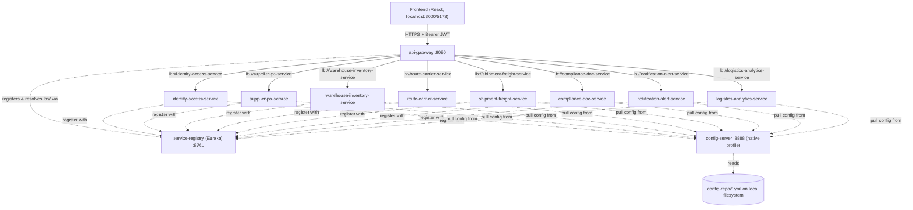
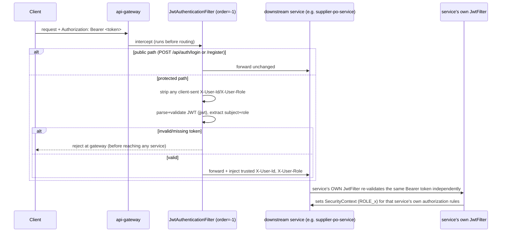

# Infrastructure — service-registry, config-server, api-gateway

> Java **17** (root `pom.xml` — corrected; not 21), Spring Boot **3.2.3**, Spring Cloud **2023.0.0**. These three modules aren't business services — they're the platform's plumbing: service discovery, centralized configuration, and the single public entry point.

---

## A. Executive Summary

**30-second version:** `service-registry` is a Netflix Eureka server every other service registers with. `config-server` hands out each service's externalized YAML config from a local `config-repo` folder. `api-gateway` is the one public door — it routes `/api/**` to the right backend service by path, handles CORS, and validates the JWT once at the edge (though every downstream service *also* re-validates it — see §D).

**2-minute version:** These three modules boot first, in this order: `service-registry` (Eureka, port 8761) → `config-server` (port 8888, serves `config-repo/*.yml` over HTTP, `native` profile = filesystem-backed, not git) → everything else, including `api-gateway` (port 9090), which registers with Eureka and load-balances to `lb://<service-name>` URIs resolved via Eureka. The gateway's `JwtAuthenticationFilter` is a global `GlobalFilter` with `getOrder()==-1` (runs first), validates the Bearer token, and injects trusted `X-User-Id`/`X-User-Role` headers downstream — but it also **strips any client-supplied values of those same header names first**, closing a header-spoofing hole. CORS is configured gateway-wide for `http://localhost:3000` and `:5173`.

**Detailed technical explanation:** `service-registry` is a single-dependency Spring Boot app (`spring-cloud-starter-netflix-eureka-server`) with `@EnableEurekaServer`; it doesn't register with itself (`register-with-eureka: false`, `fetch-registry: false`) and has zero security — the dashboard and REST API are wide open. `config-server` is equally minimal (`spring-cloud-config-server`, `@EnableConfigServer`), running in `native` profile pointed at a **hardcoded absolute filesystem path** to `config-repo` — not portable to another machine, and also unauthenticated, so anyone who can reach port 8888 can read every service's config, including the shared JWT secret. `api-gateway` is the most substantial of the three: Spring Cloud Gateway with 8 explicit path-based routes (no discovery-locator auto-routing), a global CORS filter, a `DedupeResponseHeader` filter, and the custom JWT filter. Resilience4j and Micrometer tracing dependencies are declared but **not actually configured** anywhere (no properties, no wiring) — dead weight.

**Business explanation:** This is the "front door" and "phone book" of the platform. Without `service-registry`, services can't find each other. Without `config-server`, no service can start (every service's `application.yml` does nothing but point at the config server). Without `api-gateway`, the frontend has no single place to talk to — it would need to know every service's individual host/port. All three are single points of failure for the whole platform.

---

## B. Business Context

**Business capability:** Cross-cutting platform infrastructure — not a business domain in itself, but a prerequisite for every business capability (suppliers, shipments, compliance, etc.) to function.

**Actors:** Every microservice (registers with Eureka, pulls config from Config Server); the frontend and any external caller (enters exclusively through the Gateway).

**Business impact if unavailable:**
- `service-registry` down: existing service instances keep running with cached registry info for a while, but the Gateway can't resolve `lb://` URIs for any *new* instance, and any service restarted during the outage can't register — cascading failure risk.
- `config-server` down: any service that hasn't already started **cannot start at all** (`spring.config.import: configserver:...` is a hard startup dependency for every business service). Already-running services are unaffected until their next restart.
- `api-gateway` down: the entire platform is unreachable from the frontend — total outage from the user's perspective, even though every business service might be perfectly healthy.

---

## C. Repository Structure (annotated)

```
LOGI-TRACK-MICRO-SERVICE/
├── pom.xml                          # Parent aggregator POM — pins Java 17, Spring Boot 3.2.3,
│                                     #  Spring Cloud 2023.0.0, Lombok 1.18.34; lists all 11 modules
├── config-repo/                     # THE config source-of-truth — one YAML per service, served by
│   │                                 #  config-server at startup-time (fetched once per service boot,
│   │                                 #  not live-reloaded unless /actuator/refresh is called — not
│   │                                 #  confirmed wired in this codebase)
│   ├── application.yml              #  shared defaults (incl. a shared jwt.secret) applied to all services
│   ├── api-gateway.yml              #  gateway routes, CORS, JWT secret, actuator exposure
│   ├── identity-access-service.yml
│   ├── supplier-po-service.yml
│   ├── route-carrier-service.yml
│   ├── warehouse-inventory-service.yml
│   ├── shipment-freight-service.yml
│   ├── compliance-doc-service.yml
│   ├── notification-alert-service.yml
│   └── logistics-analytics-service.yml
├── service-registry/                # Eureka server — boots FIRST
│   └── src/main/java/.../ServiceRegistryApplication.java   # @EnableEurekaServer
├── config-server/                   # Config server — boots SECOND (after registry, before everyone else)
│   └── src/main/java/.../ConfigServerApplication.java      # @EnableConfigServer, native profile
└── api-gateway/                     # Public entry point — boots after registry+config, but before
    │                                 #  it can route anywhere, downstream services must also be up
    └── src/main/java/com/cognizant/logitrack/
        ├── ApiGatewayApplication.java
        └── filter/
            └── JwtAuthenticationFilter.java   # GlobalFilter, order=-1, runs on every request
```

---

## D. Architecture



**Gateway routes** (from `config-repo/api-gateway.yml`):

| Route id | Target | Path predicate(s) |
|---|---|---|
| identity-access-service | `lb://identity-access-service` | `/api/auth/**`, `/api/users/**` |
| supplier-po-service | `lb://supplier-po-service` | `/api/suppliers/**`, `/api/purchase-orders/**` |
| warehouse-inventory-service | `lb://warehouse-inventory-service` | `/api/inventory/**`, `/api/inbound-receipts/**`, `/api/pick-lists/**` |
| route-carrier-service | `lb://route-carrier-service` | `/api/routes/**`, `/api/carriers/**`, `/api/rate-cards/**` |
| shipment-freight-service | `lb://shipment-freight-service` | `/api/shipments/**`, `/api/freight-orders/**`, `/api/delivery-events/**` |
| compliance-doc-service | `lb://compliance-doc-service` | `/api/shipment-documents/**`, `/api/compliance-flags/**` |
| notification-alert-service | `lb://notification-alert-service` | `/api/notifications/**` |
| logistics-analytics-service | `lb://logistics-analytics-service` | `/api/logistics-reports/**` |

`spring.cloud.gateway.discovery.locator.enabled: false` — routes are explicit, not auto-derived from the Eureka registry.

**CORS:** applies to `/**`; origins `http://localhost:3000`, `http://localhost:5173`; methods GET/POST/PUT/PATCH/DELETE/OPTIONS; headers Authorization/Content-Type/Accept; exposes `Location`; credentials allowed. A global filter (`DedupeResponseHeader=Access-Control-Allow-Credentials Access-Control-Allow-Origin`) prevents duplicate CORS headers when a downstream service also sets them.



**Key architectural note — double JWT validation:** the gateway validates the JWT AND every downstream service independently validates it again with its own `JwtFilter`/`JwtUtil` (confirmed present in every business service's `security/` package, each configured with the **same shared secret** from `config-repo`). This is defense-in-depth (a service is still safe if reached directly, bypassing the gateway) but means token validation logic — and the plaintext secret — is duplicated 9 times across the codebase.

---

## E. Startup & Runtime Lifecycle

Correct boot order (a manual/operational concern since there's no orchestration like Docker Compose `depends_on` in this repo — no Docker/Kubernetes files exist at all):

1. **`service-registry`** starts first (port 8761) — has no dependency on anything else (no config-server import, self-contained `application.yml`).
2. **`config-server`** starts second (port 8888) — also has no config-server dependency on itself; reads `config-repo` directly off disk via `native` profile. Registers with Eureka is not required for it to serve config (any service that knows the hardcoded `http://localhost:8888` URL can fetch config regardless of Eureka).
3. **Every business service + `api-gateway`** starts after both of the above: each has `spring.config.import: configserver:http://localhost:8888` in its local `application.yml`, which is a **hard startup blocker** — Spring Cloud Config Client will fail application startup if the config server isn't reachable. Once config is fetched, the service registers with Eureka using the `eureka.client.serviceUrl.defaultZone` property pulled from that same config.
4. Framework-generated behavior throughout: Spring Boot's auto-configuration wires the embedded Tomcat/Netty (Gateway uses Netty via WebFlux), Eureka client heartbeats, and `DispatcherServlet`/`DispatcherHandler` routing — none of this is custom code in these three modules beyond the annotations (`@EnableEurekaServer`, `@EnableConfigServer`) and the gateway's one custom filter.
5. Graceful shutdown: standard Spring Boot behavior; no custom hooks found in any of the three modules.

---

## F. "API" surface

These modules don't expose business APIs, but they do expose operational surfaces worth documenting:

| Surface | Path | Auth | Notes |
|---|---|---|---|
| Eureka dashboard/REST | `service-registry:8761/` | **None** | Fully open — shows every registered instance, health status. |
| Config-server config fetch | `config-server:8888/{application}/{profile}` | **None** | Fully open — anyone reaching port 8888 can read any service's YAML, including the shared JWT secret. |
| Gateway actuator | `api-gateway:9090/actuator/{health,info,gateway}` | Depends on gateway's own filter chain | The `gateway` actuator endpoint exposes live route introspection; exposure list is `health,info,gateway` per `config-repo/api-gateway.yml`. |
| All business routes | `api-gateway:9090/api/**` | JWT (validated at gateway AND again at the target service) | See routing table in §D. |

---

## G. End-to-End Request Flow — any authenticated API call

1. Client sends `GET/POST/... /api/<resource>` with `Authorization: Bearer <jwt>` to `localhost:9090`.
2. Spring Cloud Gateway's routing predicates match the path against the table in §D and select a target `lb://` URI.
3. `JwtAuthenticationFilter` (order -1) runs first: if the path is one of the two public auth endpoints, it passes through untouched; otherwise it strips any incoming `X-User-Id`/`X-User-Role` headers (anti-spoofing), parses/validates the JWT, and — on success — injects fresh, trusted `X-User-Id`/`X-User-Role` headers before forwarding.
4. The gateway's global `DedupeResponseHeader` filter and CORS configuration apply to the eventual response.
5. Eureka-backed load-balancing (`spring-cloud-starter-loadbalancer`) resolves `lb://<service>` to an actual host:port from the registry.
6. The request reaches the target service's own Spring Security filter chain, where **that service's own `JwtFilter`** independently re-validates the same Bearer token (not the gateway's injected headers — the downstream services were not found to trust `X-User-Id`/`X-User-Role` for authorization; they re-derive identity from the JWT itself) and sets the `SecurityContext`.
7. The target controller/service/repository executes as documented in that service's own doc.
8. Response flows back through the gateway to the client unchanged (aside from CORS/dedupe header filters).
9. **Failure branches:** invalid/missing JWT at the gateway → rejected before any business service is touched. Eureka has no healthy instance for the target service → gateway returns a routing/connection error. Config-server unreachable at a downstream service's startup → that service fails to boot entirely (never reaches step 6 for any future request).

---

## I. Production-Readiness Review

| Dimension | Finding |
|---|---|
| **Security** | Eureka dashboard and config-server are **completely unauthenticated** — a genuine gap for anything beyond a local dev environment; anyone who can reach 8761/8888 can see the whole service topology and read every secret in `config-repo`, including the shared JWT signing key. |
| **Portability** | `config-server`'s `native.search-locations` is a **hardcoded absolute Windows path** tied to one developer's machine — will not work on any other host without editing source/config. |
| **Reliability** | No Docker/Kubernetes manifests exist anywhere in the repo — deployment is manual/VM-style (assumption, confirmed by absence of any containerization files). Resilience4j and Micrometer tracing dependencies are declared in `api-gateway`'s `pom.xml` but have **zero actual configuration** — dead weight, no real circuit-breaking or distributed tracing is active at the gateway. |
| **Secrets management** | The same JWT HMAC secret is duplicated in plaintext across `config-repo/application.yml` (shared default) and every individual service's YAML — no vault/KMS indirection anywhere in the platform. |
| **Observability** | Only the `health,info,(gateway)` actuator endpoints are exposed; no metrics/tracing backend (Prometheus/Zipkin/etc.) confirmed wired despite the tracing dependency being present. |
| **Testing** | No test files were located for any of these three modules. |

---

## J. Interview Preparation

**Q: Why does the JWT get validated twice — once at the gateway and again at each service?**
A: The gateway's filter is a convenience/early-rejection layer (fail fast before wasting a network hop to a downstream service, and a place to inject trusted identity headers). But it's not solely relied upon — every business service still runs its own independent `JwtFilter`, so a service remains secure even if reached directly, bypassing the gateway. The trade-off is duplicated validation logic and a shared plaintext secret spread across 9+ config files.

**Q: What happens if config-server goes down after everything's already running?**
A: Already-running services are unaffected — they fetched their config once at startup and cached it in their Spring `Environment`. The blast radius is limited to any service that tries to **start or restart** during the outage; it would fail immediately since `spring.config.import: configserver:...` is a hard, non-optional import.

**Q: Why explicit gateway routes instead of Eureka's discovery-locator auto-routing?**
A: `spring.cloud.gateway.discovery.locator.enabled: false` — the team chose explicit path-based routes over auto-derived `/serviceId/**` routes, likely for clarity/control over the exact path prefixes exposed publicly (e.g. grouping `/api/suppliers/**` and `/api/purchase-orders/**` under one service without exposing the raw service name in the URL).

**Q: What's the single biggest availability risk in this infrastructure layer?**
A: `api-gateway` itself — since it's the only entry point the frontend knows about, its downtime is a full-platform outage even if every business service is healthy. There's no secondary gateway instance or DNS-level failover evident in this codebase.
