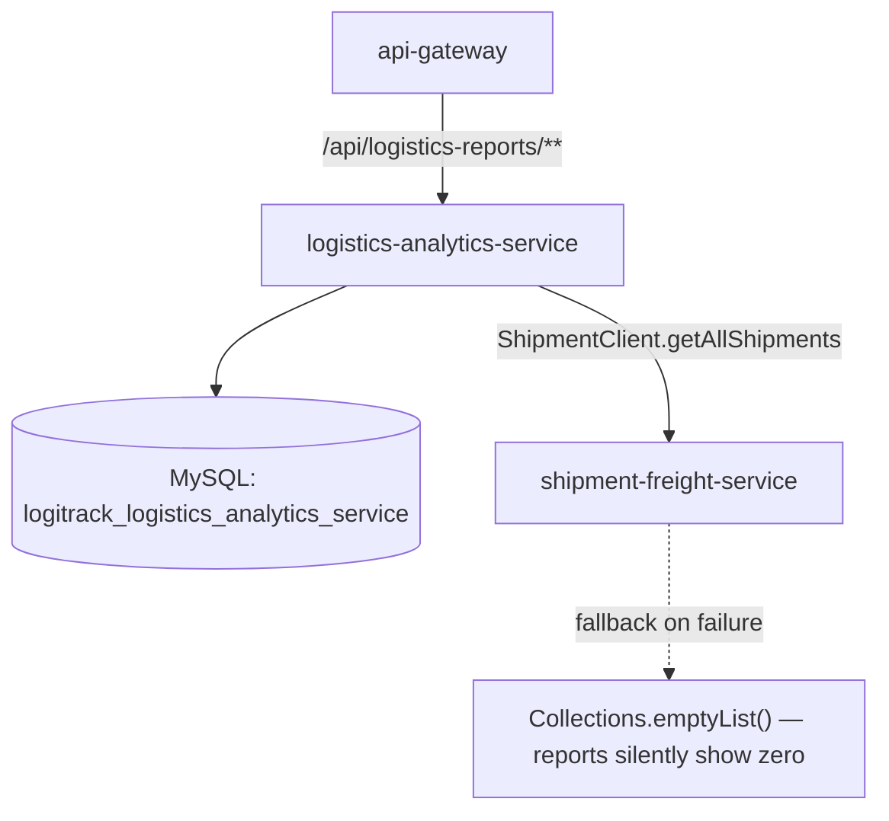
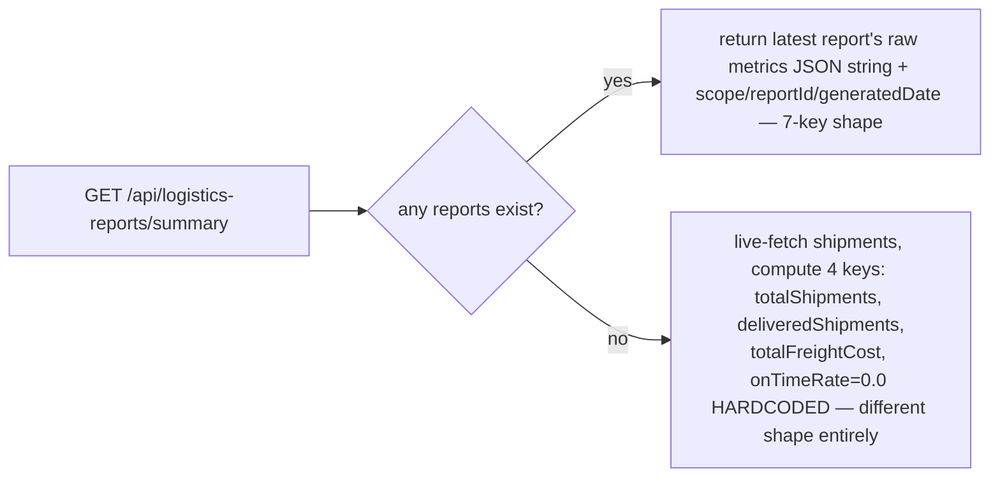

# logistics-analytics-service — Technical Documentation

> Java 17, Spring Boot 3.2.3, MySQL, JWT-secured REST. Generates `LogisticsReport` records by computing metrics live from `shipment-freight-service` data via Feign. The one service in the platform whose whole job is turning other services' data into numbers.

---

## A. Executive Summary

**30-second version:** This service computes shipment-performance metrics (delivered count, on-time rate, average transit days, total freight cost, exception rate) by pulling **all** shipments from `shipment-freight-service` and crunching them, then saves the result as a report. A `/summary` endpoint returns the latest report — or, if none exist yet, a live-computed (but structurally different and less complete) fallback.

**2-minute version:** `generateReport()` fetches every shipment (unfiltered — the request DTO's `fromDate`/`toDate` fields are accepted but **never used**, a functional gap), computes 7 metrics with `BigDecimal.setScale(1, HALF_UP)` rounding, and hand-builds the `metrics` field as a **raw JSON string via `String.format`** rather than a real serializer — meaning the API contract for that field is an unstructured string clients must parse themselves. `getSummary()` has two structurally incompatible response shapes: with existing reports, it returns the raw `metrics` JSON blob (7 keys); with none, it live-computes a **different 4-key shape** with different key names and a hardcoded `onTimeRate: 0.0` regardless of actual data. The Feign fallback for `getAllShipments()` returns an empty list (not an exception) on failure — meaning **a downed shipment-freight-service produces a silently zeroed-out report** that looks identical to "there are genuinely zero shipments," with a `201 Created` response and no error surfaced to the caller.

**Detailed technical explanation:** `LogisticsReport` has no status field — it's a pure generated/append-only record (`reportId`, `scope`, `metrics` string, `generatedDate` via `@CreationTimestamp`). `getSummary()`'s "find latest" logic is in-memory (`findAll()` + stream `.max()` by `generatedDate`), not a repository-level `findTopByOrderByGeneratedDateDesc` — inefficient at scale, loading the entire table just to find one row. Neither `ReportRequestDTO` nor `LogisticsReportDTO` carries any validation annotations, and the controller never uses `@Valid`, so `GlobalExceptionHandler`'s `MethodArgumentNotValidException` mapping is effectively dead code for this service. `LogisticsReportRepository.findByScope` is declared but never called. The one test file that exists (`AnalyticsServiceImplTest`) only asserts the service bean isn't null and doesn't even mock `ShipmentClient` into the `@InjectMocks` target — meaning any real invocation of `generateReport()`/`getSummary()` in that test class would NPE, so effectively **no behavior is actually tested.**

**Business explanation:** Ops/analytics stakeholders want to know: are we delivering on time, how long does transit actually take, what's it costing, and how often do things go wrong. This service turns raw shipment records into those answers on demand — but because it silently degrades to zero-valued output when its one data source is unreachable, a report generated during an outage looks exactly like a report showing a genuinely quiet day, which is a real risk for anyone trusting these numbers.

---

## B. Business Context

**Business capability:** Shipment-performance reporting/analytics.

**Actors:** `ANALYST`/`ADMIN` (read all reports, read summary); **any authenticated user** (generate a report — no role restriction on the POST endpoint, notably looser than the GET endpoints).

**Upstream systems:** None call this service.

**Downstream systems:** `shipment-freight-service`, via `ShipmentClient` (`getAllShipments()` — the only method actually called; `getShipmentById()` is declared but unused here).

**Business impact if unavailable:** No new reports can be generated; `/summary` still works if at least one report already exists (reads from this service's own DB, not live from shipment-freight-service, in that case) — so historical numbers remain visible even if this service or its upstream dependency is degraded, but nothing new can be computed.

### Use case: Generate a logistics report
1. **Actor:** any authenticated user.
2. **Trigger:** `POST /api/logistics-reports` with an optional `scope`/`fromDate`/`toDate` (dates currently unused).
3. **Preconditions:** none enforced by validation (no `@Valid`, no annotations on the DTO).
4. **Main flow:** all shipments fetched → 7 metrics computed → hand-built JSON string saved as a new report row.
5. **Failure flow:** if `shipment-freight-service` is unreachable, the Feign fallback returns an empty list — the report is **still created successfully** (`201`), but every metric is zero, indistinguishable from a genuinely-empty shipment system.
6. **Business result:** a timestamped snapshot exists — its trustworthiness depends entirely on the upstream service having actually been reachable at generation time, which the API gives the caller no way to verify.

### Use case: Check the latest summary
1. **Actor:** ANALYST/ADMIN.
2. **Trigger:** `GET /api/logistics-reports/summary`.
3. **Main flow:** if any report exists, returns the most recently generated one's raw metrics blob + scope/reportId/generatedDate; if none exist, live-computes a smaller, differently-shaped map from current shipment data (with `onTimeRate` hardcoded to `0.0`).
4. **Business result:** two different JSON shapes from the same endpoint depending on report history — API consumers must handle both.

---

## C. Repository Structure (annotated)

```
logistics-analytics-service/src/main/java/com/cognizant/logitrack/
├── entity/
│   └── LogisticsReport.java        # reportId, scope(length=50), metrics(TEXT — hand-built JSON string),
│                                     #  generatedDate(@CreationTimestamp) — NO status field
├── dto/
│   ├── LogisticsReportDTO.java     # output shape, no validation
│   └── ReportRequestDTO.java       # scope, fromDate, toDate — no validation, dates UNUSED by the service
├── controller/
│   └── LogisticsReportController.java  # POST generate, GET all, GET by id, GET /summary
├── service/ + serviceImplementation/
│   └── LogisticsReportService(Impl).java  # generateReport (the metrics math), getSummary (2 incompatible shapes)
├── repository/
│   └── LogisticsReportRepository.java  # findByScope (unused), findAll (used for in-memory "latest" lookup)
├── client/
│   ├── ShipmentClient.java             # -> shipment-freight-service, getAllShipments (used), getShipmentById (unused)
│   └── ShipmentClientFallbackFactory.java  # returns emptyList on failure — silent zeroed-out reports
├── exception/ (BadRequestException — defined, never thrown; ResourceNotFoundException; GlobalExceptionHandler)
└── config/SecurityConfig.java + FeignClientInterceptor.java + security/JwtFilter.java, JwtUtil.java
```

Config: `config-repo/logistics-analytics-service.yml` — Resilience4j default instance defined but **not confirmed wired via `@CircuitBreaker`** to `ShipmentClient` — reliance is entirely on Feign's `fallbackFactory` mechanism.

---

## D. Architecture



```mermaid
sequenceDiagram
  participant C as Client
  participant Ctrl as LogisticsReportController
  participant Svc as LogisticsReportServiceImpl
  participant SC as ShipmentClient (Feign)
  participant Repo as LogisticsReportRepository

  C->>Ctrl: POST /api/logistics-reports {scope?, fromDate?, toDate?}
  Ctrl->>Svc: generateReport(req)
  Svc->>SC: getAllShipments()
  alt shipment-freight-service down
    SC-->>Svc: [] (fallback, logged ERROR server-side only)
  else success
    SC-->>Svc: List&lt;ShipmentDTO&gt;
  end
  Svc->>Svc: compute shipmentCount, deliveredCount, exceptionCount,\nonTimeRate, avgTransitDays, totalFreightCost, exceptionRate
  Note over Svc: fromDate/toDate from request are IGNORED — no filtering applied
  Svc->>Svc: metrics = String.format("{...}", ...) — hand-built JSON string
  Svc->>Repo: save(LogisticsReport{scope, metrics})
  Svc-->>C: 201 Created (looks identical whether shipments were real or the fallback fired)
```



---

## E. Startup & Runtime Lifecycle

Standard platform pattern — see `infrastructure.md` §E. `FeignClientInterceptor` propagates the inbound `Authorization` header onto the outbound `ShipmentClient` call, same pattern as other Feign-consuming services.

---

## F. API Documentation

### `POST /api/logistics-reports` — any authenticated user (no role restriction)
**Request (`ReportRequestDTO`):** `scope` (defaults to `"GLOBAL"` if blank/null), `fromDate`/`toDate` (**accepted but never used** — advertised date-filtering that isn't implemented).
**Response `201`:** the created `LogisticsReportDTO`, `metrics` as a raw JSON **string**.

```json
// Sample request
{ "scope": "GLOBAL" }
// Sample response (201) — note metrics is a STRING, not a nested object
{
  "reportId": 14, "scope": "GLOBAL",
  "metrics": "{\"shipmentCount\":42,\"deliveredCount\":30,\"exceptionCount\":3,\"onTimeRate\":86.7,\"avgTransitDays\":3.2,\"totalFreightCost\":184230.50,\"exceptionRate\":7.1}",
  "generatedDate": "2026-07-28T14:40:02"
}
```

### `GET /api/logistics-reports` / `GET /api/logistics-reports/{id}` — ANALYST/ADMIN
Plain reads; `{id}` throws `404` if missing.

### `GET /api/logistics-reports/summary` — ANALYST/ADMIN
See the two-shapes issue in §D. Sample of the **fallback (no reports yet)** shape:
```json
{ "totalShipments": 42, "deliveredShipments": 30, "totalFreightCost": 184230.50, "onTimeRate": 0.0 }
```
Note `onTimeRate` here is **always 0.0** regardless of the real on-time performance — only the "with existing reports" branch computes a real on-time rate.

---

## G. End-to-End Request Flow — `POST /api/logistics-reports`

1. Request via gateway, `/api/logistics-reports/**` predicate; JWT validated; `SecurityConfig`'s only restriction on this specific method is the catch-all `authenticated()` (no specific role required to generate a report, unlike reading one).
2. `LogisticsReportController.generateReport` — no `@Valid`, so the DTO's contents are never validated even though the class exists.
3. `LogisticsReportServiceImpl.generateReport`: `shipmentClient.getAllShipments()` — a Feign call with a configured fallback factory (returns `[]` on any circuit-breaker/network failure, logging at ERROR server-side only, invisible to the API caller).
4. Computes: `shipmentCount`, `deliveredCount` (string-equals `"DELIVERED"`), `exceptionCount` (`"EXCEPTION"` or `"DELAYED"`), `onTimeRate` (% of delivered shipments where `actualArrival <= estimatedArrival`, only over shipments with both dates present), `avgTransitDays` (mean of `dispatchDate.until(actualArrival, DAYS)` over delivered shipments with a dispatch date), `totalFreightCost` (sum across **all** shipments, not just delivered), `exceptionRate`. All percentages/averages rounded to 1 decimal via `BigDecimal.setScale(HALF_UP)`.
5. `metrics` assembled via `String.format` into a JSON-looking string (not a real serializer).
6. `scope` defaults to `"GLOBAL"` if blank.
7. Entity built and saved; `generatedDate` auto-stamped.
8. Response mapped to DTO, `201 Created` — **identical response whether the shipment data was real or entirely fallback-empty.**
9. **Failure branches:** none surfaced to the caller for the Feign-down case (silent zeroing); a genuine DB save failure → `500` via the generic handler.

---

## H. File-by-File Documentation (key files)

### `entity/LogisticsReport.java`
`reportId` (PK), `scope` (`@Column(length=50)`), `metrics` (`@Column(columnDefinition="TEXT")` — the hand-built JSON string), `generatedDate` (`@CreationTimestamp`). No status/lifecycle field, no update path anywhere — write-once, read-many.

### `serviceImplementation/LogisticsReportServiceImpl.java`
`generateReport` — the metrics-computation method, containing an internal comment referencing "Gap 12 fix," implying a prior remediation from a previously-hardcoded-values version. `getSummary` — the two-shape branching logic; its `.max(...).orElse(reports.get(reports.size()-1))` fallback is dead/unreachable code (the surrounding `if (!reports.isEmpty())` already guarantees the stream can't be empty).

### `dto/ShipmentDTO.java` (this service's local copy)
`status` is typed `String`, not the actual `ShipmentStatus` enum that exists in this same module — compared via string-literal equality (`"DELIVERED"`, `"EXCEPTION"`, `"DELAYED"`) in the service, a type-safety gap (typo-prone, no compile-time exhaustiveness).

### `client/ShipmentClientFallbackFactory.java`
Returns `Collections.emptyList()` on any failure of `getAllShipments()` — the direct cause of the silent-zeroed-report behavior described throughout this doc.

---

## I. Production-Readiness Review

| Dimension | Finding |
|---|---|
| **Silent degradation (most significant finding)** | A downed `shipment-freight-service` produces a successfully-created report with every metric at zero, with no error/warning surfaced anywhere in the HTTP response — indistinguishable from a genuinely quiet period. |
| **Unstructured API contract** | `metrics` is a hand-built `String.format` JSON blob, not a real object — fragile to field changes, forces every consumer to parse it themselves. |
| **Inconsistent response shapes** | `getSummary()` returns two structurally different maps depending on report history, including a hardcoded `onTimeRate: 0.0` in the no-reports-yet branch. |
| **Unused advertised feature** | `ReportRequestDTO.fromDate`/`toDate` are accepted by the API but never applied — no date-range filtering actually exists. |
| **Inefficient query** | `getSummary()`'s "find the latest report" loads the entire `logistics_reports` table via `findAll()` rather than a targeted `findTopByOrderByGeneratedDateDesc` query. |
| **Weak typing** | `ShipmentDTO.status` is a `String` compared against literals despite a `ShipmentStatus` enum existing in the same codebase. |
| **Dead code** | `LogisticsReportRepository.findByScope` unused; `BadRequestException` defined but never thrown; the `.max().orElse(...)` fallback in `getSummary` is unreachable. |
| **Test coverage** | The one test file only asserts the service bean is non-null and doesn't even wire `ShipmentClient` as a mock into `@InjectMocks` — any real test invoking `generateReport`/`getSummary` would NPE. Effectively zero behavioral coverage. |
| **Security** | `POST` (generate) has no role restriction, notably looser than the `GET` endpoints (ANALYST/ADMIN) — any authenticated user, including e.g. a `DRIVER`, can trigger report generation. |

---

## J. Interview Preparation

**Q: What happens to a report if shipment-freight-service is down when you generate it?**
A: The Feign fallback factory catches the failure and returns an empty list instead of propagating an exception — so `generateReport()` proceeds normally, computing every metric against zero shipments, and successfully saves and returns a `201 Created` report. There is no flag, warning, or distinguishing field in the response indicating the data source was actually unreachable — it looks byte-for-byte identical to a legitimately empty shipment system. If I were hardening this, I'd have the fallback either propagate a distinguishable error, or have the service tag reports generated during a fallback with a `dataComplete: false`-style field.

**Q: Why is `metrics` a string instead of a structured object?**
A: It's built with `String.format` directly into a JSON-looking string rather than serialized via Jackson's `ObjectMapper` from a proper metrics class. It works today because all the values are simple numerics with no special characters to escape, but it's fragile — adding, renaming, or restructuring a metric means hand-editing a format string and its consumers' parsing code in lockstep, with no compile-time safety net.

**Q: How would you fix the two-different-shapes problem in `/summary`?**
A: Normalize both branches to return the same DTO shape — parse the latest report's `metrics` JSON string into the same 7-key structure the "no reports yet" fallback approximates, and actually compute a real `onTimeRate` in that fallback branch instead of hardcoding it to `0.0`, so callers get one consistent contract regardless of report history.
