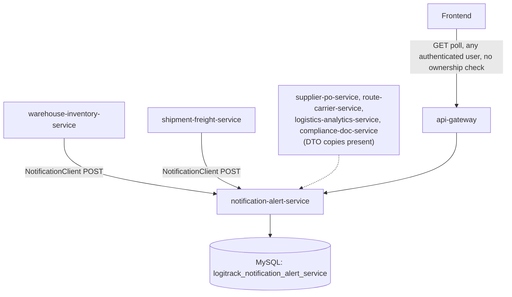
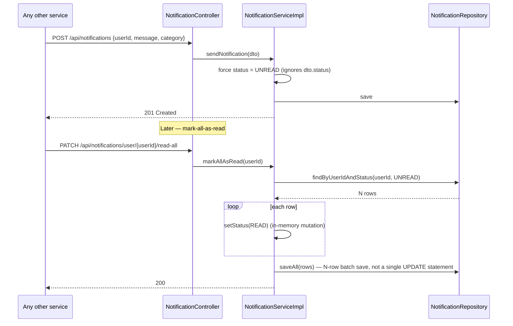

# notification-alert-service — Technical Documentation

> Java 17, Spring Boot 3.2.3, MySQL, JWT-secured REST. A **purely database-backed in-app notification inbox** — no email, SMS, or push delivery of any kind exists anywhere in the codebase (confirmed by grep for mail/SMTP/Twilio/SendGrid/FCM/push — zero hits).

---

## A. Executive Summary

**30-second version:** This service stores and serves in-app notifications for users across the platform (shipment updates, warehouse alerts, compliance issues, carrier events). It's called by other services via Feign whenever something notification-worthy happens; there is no real-time push — clients must poll the read endpoints.

**2-minute version:** One entity, `Notification` (`userId` as a plain int, `message`, `category`, `status`, `createdDate`). Every notification is created `UNREAD` regardless of what the client sends. `markAllAsRead` is implemented as a **loop-and-save**, not a single bulk `UPDATE` query — it fetches every `UNREAD` row for the user, flips each to `READ` in memory, then `saveAll`s the batch. `NotificationStatus.DISMISSED` is a defined enum value that **no code path ever assigns** — there's no dismiss endpoint despite the status existing. The most significant finding: **`SecurityConfig` has no ownership check at all** — any authenticated user, regardless of role, can create a notification for *any* `userId`, read *any* other user's notifications, or mark them read. The `{userId}` path parameter is never cross-checked against the JWT's own subject/user identity.

**Detailed technical explanation:** `NotificationController` exposes 6 endpoints, none with `@PreAuthorize`; `SecurityConfig`'s only rule for this service is `.requestMatchers("/api/notifications/**").authenticated()` — a blanket "any logged-in user" rule with zero role or ownership restriction, notably looser than every other business service in the platform (which all gate by specific roles). Five other services (confirmed: warehouse-inventory-service, shipment-freight-service; DTO copies also present without full client-class verification in supplier-po-service, route-carrier-service, logistics-analytics-service, compliance-doc-service) call this service's `POST /api/notifications` via their own `NotificationClient` Feign interface — this service is a pure **inbound** dependency for the rest of the platform, with **zero outbound calls** of its own (the declared `@EnableFeignClients`/OpenFeign dependency is unused boilerplate here).

**Business explanation:** When a shipment dispatches, a pick list gets assigned, or a compliance flag is raised, the relevant service tells this one "notify user X" — this is the platform's single notification inbox, read by polling (`GET .../user/{userId}` or `.../unread`), not pushed to the user in real time.

---

## B. Business Context

**Business capability:** Cross-cutting, in-app-only notification delivery and inbox management.

**Actors:** Every authenticated user (no role restriction whatsoever); every other business service (as a Feign caller creating notifications on users' behalf).

**Upstream systems:** None call this service to be notified of anything — it's a pure recipient of Feign calls.

**Downstream systems:** None — no outbound calls exist from this service to any other.

**Business impact if unavailable:** Other services' notification-sending calls would fail — but critically, **most callers swallow that failure silently or fail open** (e.g. `shipment-freight-service`'s notification sends are wrapped in best-effort try/catch; `warehouse-inventory-service`'s `PickListServiceImpl.sendNotification` has an *empty* catch block) — so the rest of the platform keeps functioning, just without any user-visible alerts. Users simply stop seeing new notifications until service is restored.

### Use case: A downstream event triggers a notification
1. **Actor:** any other microservice (system actor, not a human).
2. **Trigger:** e.g. `shipment-freight-service` dispatching a shipment.
3. **Main flow:** the calling service's `NotificationClient.sendNotification(dto)` → `POST /api/notifications` → row inserted with `status=UNREAD` (forced, regardless of DTO input) and a server-stamped `createdDate`.
4. **Failure flow:** if this service is down or errors, the calling service typically swallows the failure (patterns vary by caller — some log, one is a silent empty catch) — the triggering business operation (e.g. dispatch) is **not** blocked by a notification failure.
5. **Business result:** a user has a new item in their in-app inbox (or doesn't, silently, if the call failed).

### Use case: User checks their notifications
1. **Actor:** any authenticated user.
2. **Trigger:** `GET /api/notifications/user/{userId}` or `.../unread` or `.../count`.
3. **Main flow:** straightforward read, no filtering beyond user/status.
4. **Business result:** the user sees their notification history — **but note the access-control gap**: nothing stops user A from reading user B's notifications by simply changing the `{userId}` path segment, since there's no ownership check tying it to the caller's own JWT identity.

---

## C. Repository Structure (annotated)

```
notification-alert-service/src/main/java/com/cognizant/logitrack/
├── entity/
│   └── Notification.java           # userId(plain int), message(TEXT), category, status(UNREAD default), createdDate(@CreationTimestamp)
├── enums/
│   ├── NotificationCategory.java   # SHIPMENT, WAREHOUSE, COMPLIANCE, CARRIER
│   └── NotificationStatus.java     # UNREAD, READ, DISMISSED (DISMISSED never assigned by any code)
├── dto/
│   └── NotificationDTO.java        # userId @NotNull, category @NotNull, message/status unvalidated
├── controller/
│   └── NotificationController.java # /api/notifications — 6 endpoints, zero @PreAuthorize
├── service/ + serviceImplementation/
│   └── NotificationService(Impl).java  # sendNotification, getByUser, getUnreadByUser, markAsRead,
│                                         #  markAllAsRead(loop+save, not bulk UPDATE), getUnreadCount
├── repository/
│   └── NotificationRepository.java # findByUserId, findByUserIdAndStatus, countByUserIdAndStatus
├── exception/
│   ├── BadRequestException.java    # defined, wired into GlobalExceptionHandler, but NEVER thrown anywhere
│   ├── ResourceNotFoundException.java  # thrown only from markAsRead when id not found
│   └── GlobalExceptionHandler.java
└── config/SecurityConfig.java + security/JwtFilter.java, JwtUtil.java
```

Config: `config-repo/notification-alert-service.yml` — port `8087`, MySQL `logitrack_notification_alert_service`, Eureka, JWT secret/expiration, Resilience4j default instance (unused — no `@FeignClient`/`@CircuitBreaker` exists in this module at all).

---

## D. Architecture





---

## E. Startup & Runtime Lifecycle

Standard platform pattern — see `infrastructure.md` §E. Nothing service-specific.

---

## F. API Documentation

### `POST /api/notifications` — any authenticated user (no role/ownership restriction)
**Request (`NotificationDTO`):** `userId` `@NotNull`, `category` `@NotNull`, `message`/`status` unvalidated (status ignored — always forced `UNREAD`).

```json
// Sample request
{ "userId": 21, "message": "Shipment #900 has been dispatched.", "category": "SHIPMENT" }
// Sample response (201)
{ "notificationId": 4021, "userId": 21, "message": "Shipment #900 has been dispatched.",
  "category": "SHIPMENT", "status": "UNREAD", "createdDate": "2026-07-28T14:32:10" }
```

### `GET /api/notifications/user/{userId}` — any authenticated user, **no ownership check**
Returns all notifications for the given user, in whatever order the repository/DB returns them (no explicit `ORDER BY`).

### `GET /api/notifications/user/{userId}/unread` — same access gap
Filters to `UNREAD` only.

### `PATCH /api/notifications/{id}/read` — any authenticated user
Sets a single notification `READ`; `404` if the id doesn't exist.

### `PATCH /api/notifications/user/{userId}/read-all` — any authenticated user
Bulk mark-read via loop+save (see §D). Returns `200` with an empty body.

### `GET /api/notifications/user/{userId}/count` — any authenticated user
Returns `{"count": N}` of unread notifications.

---

## G. End-to-End Request Flow — `PATCH /api/notifications/user/{userId}/read-all`

1. Request via gateway, `/api/notifications/**` predicate; JWT validated; `SecurityConfig` requires only `authenticated()` — **no check that `{userId}` matches the caller's own identity.**
2. `NotificationController.markAllAsRead(userId)` → `NotificationServiceImpl.markAllAsRead(userId)` (`@Transactional`).
3. `notificationRepository.findByUserIdAndStatus(userId, UNREAD)` — one `SELECT` returning every currently-unread row for that user.
4. In-memory loop sets each row's `status = READ`.
5. `saveAll(unread)` — one batched `UPDATE`-per-row (via JPA's dirty-checking/merge, not a single SQL `UPDATE ... WHERE`).
6. `200 OK`, empty body.
7. **Failure branches:** no rows found → no-op success (not an error); any DB failure → `500` via the generic handler.

---

## H. File-by-File Documentation (key files)

### `entity/Notification.java`
`userId` (plain int, no relationship — cross-service reference to `identity-access-service`'s `User`), `message` (`@Column(columnDefinition="TEXT")`), `category` (`NotificationCategory`), `status` (`NotificationStatus`, `@Builder.Default = UNREAD`), `createdDate` (`@CreationTimestamp`, immutable). No `readAt`/`updatedDate` timestamp — there's no record of *when* something was marked read.

### `serviceImplementation/NotificationServiceImpl.java`
`sendNotification` — hardcodes `status=UNREAD` regardless of DTO input. `markAllAsRead` — the loop+save pattern (see §D), functionally correct but an N-read-then-N-write pattern rather than a single bulk `@Modifying @Query("UPDATE Notification n SET n.status=:s WHERE ...")`, which would be considerably more efficient at scale. No method ever sets `DISMISSED`.

### `config/SecurityConfig.java`
The only rule: `/api/notifications/**` → `authenticated()`. This is the loosest access-control posture of any business service in the platform — every other service gates by specific roles (`ADMIN`, `COORDINATOR`, etc.); this one gates by "logged in at all," with no ownership tie between the `{userId}` path variable and the caller's own JWT subject.

---

## I. Production-Readiness Review

| Dimension | Finding |
|---|---|
| **Access control gap (most significant finding)** | No ownership check anywhere — any authenticated user can create, read, or mark-read notifications belonging to *any other* user, simply by changing the `{userId}` path segment. This is a real cross-user data-exposure risk. |
| **No delivery channel** | Purely a polled database inbox — no push/email/SMS side-channel exists; a user only sees new notifications when their client happens to poll. |
| **Inefficient bulk update** | `markAllAsRead` is N reads + N writes, not a single `UPDATE` statement. |
| **Dead enum value** | `NotificationStatus.DISMISSED` defined, never assigned — no dismiss capability despite the state existing. |
| **Dead exception class** | `BadRequestException` wired into `GlobalExceptionHandler` but never thrown anywhere in this module. |
| **Testing** | One trivial test found (`markAsRead` not-found case only) — no coverage of `sendNotification`, `markAllAsRead`, `getUnreadCount`, or the controller layer. |
| **Unused infra** | `@EnableFeignClients`/OpenFeign dependency declared but this service makes zero outbound calls. |

---

## J. Interview Preparation

**Q: What's the single biggest security concern in this service, and how would you fix it?**
A: There's no ownership check between the `{userId}` path parameter and the authenticated caller's own identity — any logged-in user can read or manipulate any other user's notifications. I'd fix this by extracting the authenticated user's ID from the JWT/`SecurityContext` (the platform already does this in other services via the gateway's injected `X-User-Id` header, or by parsing the JWT subject directly) and either rejecting mismatched requests outright, or restricting the `{userId}`-scoped endpoints to admins/self only via `@PreAuthorize`.

**Q: Why is `markAllAsRead` implemented as a loop instead of a bulk update?**
A: It's simpler to write with Spring Data's standard `save`/`saveAll` and JPA dirty-checking, and at the platform's current scale it's functionally correct. It doesn't scale well though — a user with thousands of unread notifications would trigger thousands of individual row updates instead of one `UPDATE ... WHERE user_id=? AND status='UNREAD'` statement. I'd replace it with an `@Modifying @Query` bulk update for a production-scale fix.

**Q: Why does this service exist as a separate microservice instead of being embedded in each domain service?**
A: Centralizing notification storage means every domain service (shipment, warehouse, compliance, carrier) has one consistent place to push user-facing alerts to, and the frontend has one endpoint family to poll regardless of which domain triggered the notification — at the cost of an extra network hop and, currently, weaker access control than the domain services it serves.
