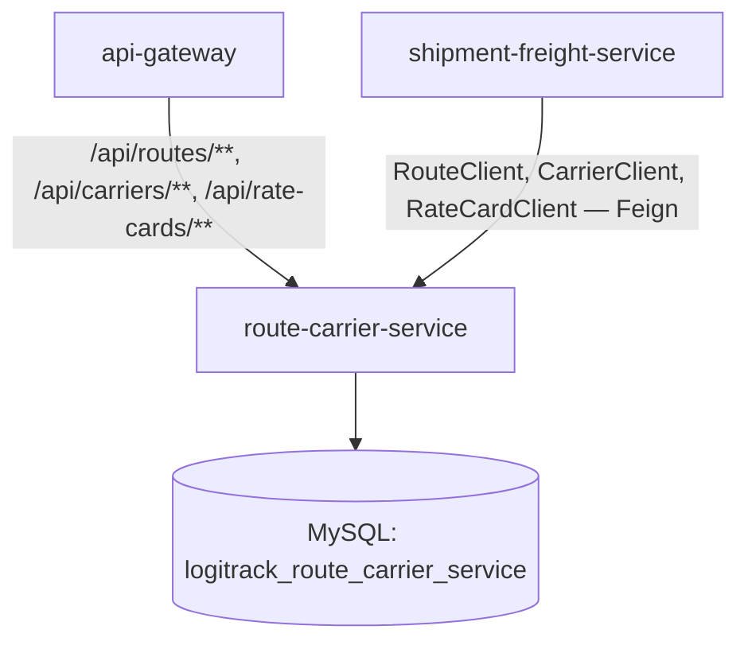
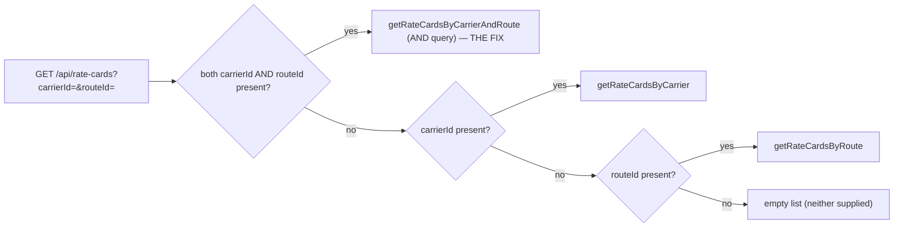

# route-carrier-service — Technical Documentation

> Java 17, Spring Boot 3.2.3, MySQL, JWT-secured REST. Owns **Routes** (lanes between hubs), **Carriers** (transport vendors), and **Rate Cards** (carrier+route pricing). A pure data owner — makes **zero outbound calls** to any other service.

---

## A. Executive Summary

**30-second version:** This service answers three questions: what lanes exist between hubs (`Route`), who can carry freight on them (`Carrier`), and what it costs (`RateCard`, a carrier+route+weight-slab price with a validity window). It's the pricing/lane reference data that `shipment-freight-service` looks up when planning a shipment.

**2-minute version:** `RouteServiceImpl.addRoute` blocks duplicate active routes for the same origin/destination/mode and requires positive transit days. `RateCardServiceImpl.addRateCard` is the most heavily validated create-path in the platform: carrier and route must both exist and be `ACTIVE`, carrier's transport mode must match the route's mode, `baseRate>0`, expiry can't precede effective date, expiry can't be in the past, `weightSlab` can't be blank, and no other `ACTIVE` rate card may already exist for the same carrier+route pair (this last check doesn't consider date-window overlap, so it's stricter than it needs to be — see §I). The **combined carrier+route search fix is confirmed present and correct**: `GET /api/rate-cards?carrierId=&routeId=` checks the combined branch first, backed by a real `findByCarrier_CarrierIdAndRoute_RouteId` repository query. Notably, `RateCard` has **no delete endpoint at all** — only status toggling — unlike `Route` (soft-delete → `INACTIVE`) and `Carrier` (soft-delete → `SUSPENDED`).

**Detailed technical explanation:** Three `@Builder`-based JPA entities; `RateCard` has real `@ManyToOne` relationships to both `Carrier` and `Route` (the only cross-entity relationships in this module). A `findValidRateCard` JPQL query exists on the repository — date-window-aware (`effectiveDate <= shipmentDate <= expiryDate`, null bounds treated as open-ended) — but it is **completely unused**, called from nowhere in the service or controller layer; no endpoint exposes "find the applicable rate for a shipment on a given date." Security is URL-pattern-based: all GETs require `COORDINATOR` or `ADMIN`; all mutations require `ADMIN` only. No `@FeignClient` exists anywhere despite OpenFeign/Resilience4j being declared dependencies.

**Business explanation:** Before a shipment can be planned, the platform needs to know: is there a valid lane, which carriers can run it, and what will it cost. This service is that reference data. Deactivating a carrier or route doesn't delete history — existing shipments/rate cards referencing them remain intact, they simply can't be used for *new* bookings (enforced by `shipment-freight-service`'s Feign calls into this service, not by this service itself).

---

## B. Business Context

**Business capability:** Lane and carrier master data + carrier pricing.

**Actors:** `COORDINATOR` (read), `ADMIN` (read + write).

**Upstream systems:** `shipment-freight-service` calls this service via three Feign clients — `RouteClient`, `CarrierClient`, `RateCardClient` — during shipment creation/dispatch (see shipment-freight-service.md §5, §9). This is the **only** confirmed consumer.

**Downstream systems:** None — zero outbound Feign calls exist in this module.

**Business impact if unavailable:** No new routes/carriers/rate cards can be managed, and (more importantly) `shipment-freight-service` cannot create or dispatch new shipments (its Feign calls to this service would fail) — a hard dependency for the shipment lifecycle, not just an administrative inconvenience.

### Use case: Set up pricing for a lane
1. **Actor:** ADMIN.
2. **Trigger:** `POST /api/rate-cards`.
3. **Preconditions:** referenced carrier and route both exist and are `ACTIVE`; carrier's `mode` matches the route's `mode`.
4. **Main flow:** all validations pass (see §D for full chain) → `status` forced `ACTIVE` → saved.
5. **Failure flow:** any single validation failure → `400` with a specific message (e.g. "carrier mode does not match route mode").
6. **Business result:** a bookable price exists for that carrier+route+weight-slab combination within the given date window.

### Use case: Search rate cards by carrier AND route (the fixed bug)
1. **Actor:** COORDINATOR or ADMIN.
2. **Trigger:** `GET /api/rate-cards?carrierId=5&routeId=12`.
3. **Main flow:** controller checks `carrierId != null && routeId != null` **first**, calling `getRateCardsByCarrierAndRoute` (a true `AND` query via `findByCarrier_CarrierIdAndRoute_RouteId`) — confirmed this branch is evaluated before the single-field branches, so both filters are honored together.
4. **Business result:** returns only rate cards matching both the specific carrier and the specific route, not the (incorrect) prior behavior of matching carrier alone and ignoring route.

---

## C. Repository Structure (annotated)

```
route-carrier-service/src/main/java/com/cognizant/logitrack/
├── RouteCarrierApplication.java     # @EnableFeignClients, @EnableDiscoveryClient — both unused (no Feign clients exist)
├── entity/
│   ├── Route.java                  # originHubId, destinationHubId, transitDays, mode, status(ACTIVE default)
│   ├── Carrier.java                # name, mode, serviceLevel, contactDetails(NOT NULL), status(ACTIVE default)
│   └── RateCard.java                # @ManyToOne Carrier, @ManyToOne Route, baseRate, weightSlab,
│                                     #  effectiveDate, expiryDate, status(ACTIVE default)
├── enums/
│   ├── RouteMode.java               # ROAD, RAIL, AIR, SEA
│   ├── RouteStatus.java             # ACTIVE, INACTIVE
│   ├── CarrierStatus.java           # ACTIVE, SUSPENDED
│   ├── CarrierServiceLevel.java     # STANDARD, EXPRESS, OVERNIGHT
│   └── RateCardStatus.java          # ACTIVE, INACTIVE
├── dto/ (RouteDTO, CarrierDTO, RateCardDTO)
├── controller/
│   ├── RouteController.java         # /api/routes (incl. /search)
│   ├── CarrierController.java       # /api/carriers
│   └── RateCardController.java      # /api/rate-cards (combined-search fix lives here)
├── service/ + serviceImplementation/
│   ├── RouteService(Impl).java
│   ├── CarrierService(Impl).java
│   └── RateCardService(Impl).java   # the heaviest business-rule chain in the module
├── repository/
│   ├── RouteRepository.java
│   ├── CarrierRepository.java
│   └── RateCardRepository.java      # findByCarrier_CarrierIdAndRoute_RouteId (the fix), findValidRateCard (unused)
├── exception/ (BadRequestException, ResourceNotFoundException, GlobalExceptionHandler)
└── config/SecurityConfig.java + security/JwtFilter.java, JwtUtil.java
```

Config: `config-repo/route-carrier-service.yml` — port `8084`, MySQL `logitrack_route_carrier_service`, `ddl-auto: update`, Eureka, Resilience4j default instance (unused — no `@CircuitBreaker` anywhere).

---

## D. Architecture



```mermaid
sequenceDiagram
  participant C as Client (ADMIN)
  participant Ctrl as RateCardController
  participant Svc as RateCardServiceImpl
  participant CR as CarrierRepository
  participant RR as RouteRepository
  participant RCR as RateCardRepository

  C->>Ctrl: POST /api/rate-cards {carrierId, routeId, baseRate, weightSlab, effectiveDate, expiryDate}
  Ctrl->>Svc: addRateCard(dto)
  Svc->>CR: findById(carrierId)
  alt carrier missing
    Svc-->>C: 400 (BadRequestException)
  end
  Svc->>RR: findById(routeId)
  alt route missing
    Svc-->>C: 400
  end
  Svc->>Svc: carrier.status==ACTIVE? route.status==ACTIVE?
  Svc->>Svc: carrier.mode == route.mode?
  Svc->>Svc: baseRate&gt;0? expiry&gt;=effective? expiry not in past? weightSlab not blank?
  Svc->>RCR: existsByCarrier_CarrierIdAndRoute_RouteIdAndStatus(carrierId, routeId, ACTIVE)
  alt already exists
    Svc-->>C: 400 (duplicate active rate card for this lane)
  else all checks pass
    Svc->>Svc: force status = ACTIVE
    Svc->>RCR: save(rateCard)
    Svc-->>C: 201 Created
  end
```



---

## E. Startup & Runtime Lifecycle

Standard platform pattern (config-server dependency, Eureka registration, Hibernate DDL update) — see `infrastructure.md` §E. Nothing service-specific beyond that.

---

## F. API Documentation

### `POST /api/routes` — ADMIN only
Validations: origin ≠ destination; `transitDays > 0` if provided; no existing `ACTIVE` route for the same origin/destination/mode. Forces `status=ACTIVE`.

### `GET /api/routes?mode=` — COORDINATOR/ADMIN
Filters by `mode` if supplied, else returns all.

### `GET /api/routes/search?origin=&destination=&status=` — COORDINATOR/ADMIN
Returns the first matching route for the exact origin/destination/status combination, or `404` if none. **Bug:** `status` is required and parsed via `RouteStatus.valueOf` with no guard — an invalid value throws an uncaught `IllegalArgumentException`, caught only by the generic handler → `500` instead of `400`.

### `PATCH /api/routes/{id}?status=` / `DELETE /api/routes/{id}` — ADMIN only
`PATCH` sets any status with no transition validation. `DELETE` is a soft delete → `INACTIVE`, `204`.

### `POST /api/carriers` — ADMIN only
**No duplicate-check** exists here (unlike Route/RateCard) — two identical carriers can be created freely. Forces `status=ACTIVE`.

### `GET /api/carriers?mode=`, `PATCH .../status`, `DELETE .../{id}`
Same pattern as Route; `DELETE` sets `status=SUSPENDED` (not `INACTIVE` — the carrier-specific terminology).

### `POST /api/rate-cards` — ADMIN only
Full validation chain (see §D sequence diagram). **Request (`RateCardDTO`):** `carrierId`/`routeId`/`baseRate`/`effectiveDate`/`expiryDate` `@NotNull`, `weightSlab` `@NotNull` (blank strings pass bean validation but are caught manually by the service).

```json
// Sample request
{ "carrierId": 5, "routeId": 12, "baseRate": 240.00, "weightSlab": "0-50kg",
  "effectiveDate": "2026-08-01", "expiryDate": "2026-12-31" }
// Sample response (201)
{ "rateCardId": 33, "carrierId": 5, "routeId": 12, "baseRate": 240.00,
  "weightSlab": "0-50kg", "effectiveDate": "2026-08-01", "expiryDate": "2026-12-31", "status": "ACTIVE" }
```

### `GET /api/rate-cards?carrierId=&routeId=` — COORDINATOR/ADMIN
**The fixed combined search** — see §D. Neither param supplied → empty list, `200`.

### `PATCH /api/rate-cards/{id}?status=` — ADMIN only
Only way to deactivate a rate card — **no `DELETE` endpoint exists for this resource.**

---

## G. End-to-End Request Flow — `GET /api/rate-cards?carrierId=&routeId=`

1. Request enters via gateway, routed by the `/api/rate-cards/**` predicate.
2. `JwtFilter` validates the token, sets `SecurityContext`; `SecurityConfig`'s rule requires `COORDINATOR` or `ADMIN` for GET.
3. `RateCardController.get(carrierId, routeId)` checks `carrierId != null && routeId != null` **first** (the fix) → calls `rateCardService.getRateCardsByCarrierAndRoute(carrierId, routeId)`.
4. `RateCardServiceImpl.getRateCardsByCarrierAndRoute` delegates to `rateCardRepository.findByCarrier_CarrierIdAndRoute_RouteId(carrierId, routeId)` — a genuine `WHERE carrier_id = ? AND route_id = ?` query (Spring Data derived from the nested relationship property names).
5. Results mapped to `RateCardDTO` list, `200 OK`.
6. **Failure branches:** none specific to this endpoint beyond standard auth failures (`401`/`403`); an empty result set is a valid `200` with `[]`, not an error.

---

## H. File-by-File Documentation (key files)

### `entity/RateCard.java`
The only entity in this module with real JPA relationships: `@ManyToOne @JoinColumn(name="CarrierID") Carrier carrier`, `@ManyToOne @JoinColumn(name="RouteID") Route route`. Plus `baseRate` (BigDecimal), `weightSlab` (`@Column(length=100)`), `effectiveDate`/`expiryDate` (LocalDate), `status` (`@Builder.Default = ACTIVE`).

### `serviceImplementation/RateCardServiceImpl.java`
`addRateCard` — the module's most rigorous method: carrier exists → route exists → carrier `ACTIVE` → route `ACTIVE` → carrier.mode==route.mode → `baseRate>0` → expiry≥effective → expiry not in the past → weightSlab not blank → no existing `ACTIVE` card for this carrier+route pair → force `status=ACTIVE` → save. Note the FK-not-found checks throw `BadRequestException` (400) here, **inconsistent** with the `ResourceNotFoundException` (404) pattern used by every `findEntity`-style lookup elsewhere in the module — a client passing a bad `carrierId` gets a different status code than passing a bad path `{id}`.

`findValidRateCard` (repository JPQL, date-window aware) is fully implemented but **never called** — no "get the rate applicable to this shipment date" endpoint exists; likely intended for a feature that was never wired up.

### `controller/RateCardController.java`
The combined-search fix: `if (carrierId != null && routeId != null) return ...getRateCardsByCarrierAndRoute(...)` evaluated **before** the single-field branches — confirmed correct and current.

### `config/SecurityConfig.java`
Two-tier rule: all `GET` on the three resource paths → `COORDINATOR`/`ADMIN`; all other methods on those same paths → `ADMIN` only; catch-all → `authenticated()`.

---

## I. Production-Readiness Review

| Dimension | Finding |
|---|---|
| **Correctness bugs** | Unguarded `enum.valueOf` in `RouteController.search`/`updateStatus`, `CarrierController.updateStatus`, `RateCardController.updateStatus` → `500` instead of `400` on bad input. |
| **Inconsistency** | FK-not-found on `addRateCard` → `400`; every other "not found by id" → `404`. |
| **Missing feature surface** | No `DELETE`/soft-delete for `RateCard` (only `PATCH .../status`) — inconsistent CRUD shape vs. Route/Carrier. |
| **Dead code** | `findValidRateCard`, `RateCardRepository.findByStatus`, `RouteRepository.findByStatus`, a commented-out `CarrierRepository.getByStatus` line — all unused. |
| **Business-rule strictness** | The "no other ACTIVE rate card for this carrier+route" check doesn't consider date-window overlap — blocks legitimately non-overlapping time-boxed rate cards for the same lane, which `findValidRateCard`'s design suggests was intended to be supported. |
| **Data integrity gap** | `CarrierServiceImpl.addCarrier` has no duplicate-check (unlike Route/RateCard) — identical carriers can be created freely. |
| **Testing** | No test files located for this module. |

---

## J. Interview Preparation

**Q: Walk me through why the rate-card search bug happened and how the fix works.**
A: The original controller checked `if (carrierId != null) return byCarrier(...)` before checking `routeId` at all — so when both were supplied, only the carrier filter ever applied, silently ignoring the route filter. The fix adds a new branch, `carrierId != null && routeId != null`, evaluated **first**, backed by a genuine two-column repository query (`findByCarrier_CarrierIdAndRoute_RouteId`) rather than combining two separate single-field result sets in memory — this ensures the database itself enforces the AND semantics.

**Q: Why does creating a rate card check that the carrier's mode matches the route's mode?**
A: A business rule preventing nonsensical assignments — e.g. an air carrier being priced on a sea route. It's enforced at creation time only; there's no ongoing re-validation if a carrier's mode were changed after rate cards already reference it (not observed as a code path in this module — carrier mode isn't updatable via any endpoint, so this risk is currently moot).

**Q: Why is there no delete endpoint for rate cards?**
A: Unclear from the code whether this is an intentional design choice (rate cards are historical pricing records that should never be "deleted," only deactivated via status) or an oversight — either way, `PATCH .../status` to `INACTIVE` is the only mechanism, which is functionally equivalent to Route/Carrier's soft-delete but exposed under a different verb/endpoint shape.
