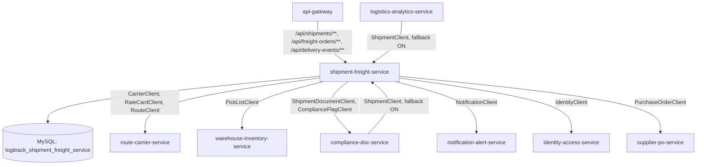
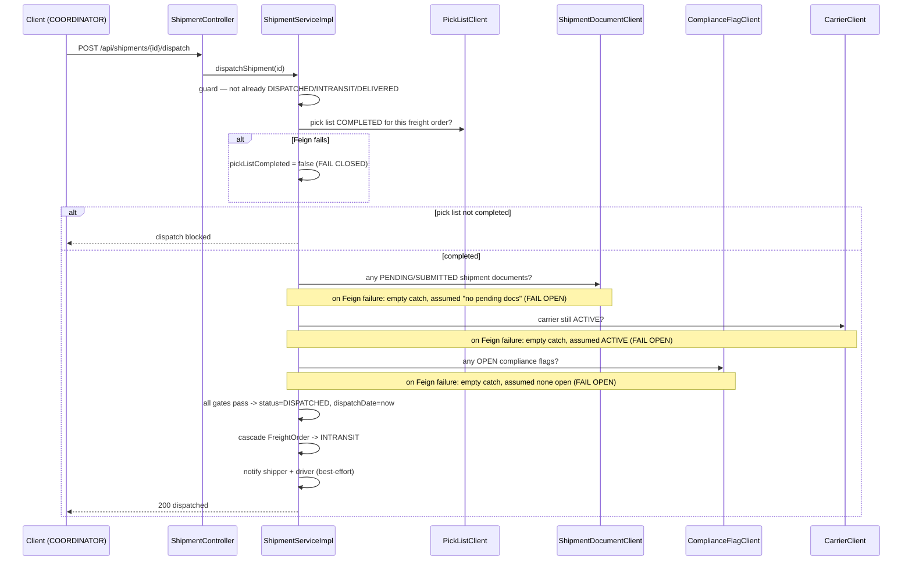

# shipment-freight-service — Technical Documentation

> Java 17, Spring Boot 3.2.3, MySQL, JWT-secured REST. The **most heavily-connected** service in the platform — owns Shipments, Freight Orders, and Delivery Events, and is BOTH a provider (called by compliance-doc-service and logistics-analytics-service) AND the biggest consumer (8 Feign clients into 6 other services).

---

## A. Executive Summary

**30-second version:** This service plans freight orders (what needs shipping, from where to where, by when), turns them into shipments (assigned to a carrier/vehicle/driver, priced via a rate card), and dispatches them — with a 4-gate pre-dispatch check (pick list complete, no pending compliance docs, carrier active, no open compliance flags) whose failure handling is **inconsistently fail-closed vs. fail-open** across the four gates.

**2-minute version:** `FreightOrderServiceImpl.createFreightOrder` validates shipper exists (Feign), optional PO exists (Feign), and an `ACTIVE` route exists for the origin/destination (Feign) — new orders start at `BOOKED`, not the entity's `DRAFT` default. `ShipmentServiceImpl.createShipment` computes `estimatedArrival = planDate + route.transitDays` and `freightCost = rateCard.baseRate * freightOrder.weight`; a `validateWeightSlab` method is called but is a documented no-op stub. `dispatchShipment` runs 4 external Feign-backed gates before allowing dispatch — gate 1 (pick-list completion check) **fails closed** on a Feign error (blocks dispatch), while gates 2–4 (documents, carrier status, compliance flags) **fail open** on a Feign error (empty catch blocks, dispatch proceeds) — a genuine business-risk inconsistency: an outage of compliance-doc-service would silently let a shipment dispatch bypassing the compliance-flag check entirely.

**Detailed technical explanation:** `Shipment` has a one-directional `@ManyToOne` to `FreightOrder` (no inverse side). `addDeliveryEvent` records tracking events but **never syncs `Shipment.status`** from the event type — posting a `DELIVERED` event does not mark the shipment delivered; that's a separate manual `updateShipmentStatus` call, meaning delivery state has two independent, potentially divergent sources of truth. Neither `updateShipmentStatus` nor `FreightOrderServiceImpl.updateStatus` enforce any state-machine transition rules. `cancelOrder` is the one guarded transition: rejects cancelling a `DELIVERED` order. `PATCH /api/freight-orders/{id}/status` has **no explicit security rule** (falls to `authenticated()`), inconsistent with `/cancel` being `COORDINATOR`/`ADMIN`-restricted — likely an oversight. Both consumer services' local `ShipmentDTO` copies declare a `trackingNumber` field this service **never populates** — always null downstream.

**Business explanation:** This is the operational core of "getting freight from A to B." A freight order is the ask ("100kg from hub 3 to hub 7 by Friday"); a shipment is the concrete plan (this carrier, this vehicle, this rate); dispatch is the moment it actually leaves, gated by real-world readiness checks (has it been picked, are the compliance docs in order, is the carrier still allowed to operate, are there any open compliance issues). Delivery events are the tracking trail a customer or ops team would see.

---

## B. Business Context

**Business capability:** Freight order planning, shipment execution, and dispatch-readiness gating.

**Actors:** `SHIPPER` (create orders), `COORDINATOR`/`ADMIN` (full lifecycle), `DRIVER` (status updates, delivery events), `ANALYST` (read-only, feeds logistics-analytics-service).

**Upstream systems (call THIS service):** `compliance-doc-service` (`ShipmentClient.getShipmentById/getAllShipments`), `logistics-analytics-service` (same two methods, used to compute report metrics).

**Downstream systems (THIS service calls):** `route-carrier-service` (Route/Carrier/RateCard), `warehouse-inventory-service` (PickList), `compliance-doc-service` (ShipmentDocument, ComplianceFlag), `notification-alert-service`, `identity-access-service` (shipper lookup), `supplier-po-service` (optional PO lookup).

**Business impact if unavailable:** No new freight orders or shipments can be created/dispatched; `logistics-analytics-service`'s report generation degrades to zeroed metrics (Feign fallback returns an empty list, not an error); `compliance-doc-service`'s document/flag creation would reject all new records (its `validateShipmentExists` treats a Feign failure as "shipment does not exist").

### Use case: Dispatch a shipment
1. **Actor:** COORDINATOR or ADMIN.
2. **Trigger:** `POST /api/shipments/{id}/dispatch`.
3. **Preconditions:** shipment exists, not already dispatched/in-transit/delivered.
4. **Main flow:** 4 gates checked in sequence (pick-list complete, no pending docs, carrier active, no open flags); if all pass, status → `DISPATCHED`, `dispatchDate=now`, cascades `FreightOrder` → `INTRANSIT`, notifies shipper + driver (best-effort).
5. **Failure flow:** gate 1 failure (or its Feign call erroring) → dispatch blocked. Gates 2–4's Feign errors are swallowed and treated as "check passed" — dispatch proceeds even if the underlying check couldn't actually be performed.
6. **Business result:** freight physically begins transit — but the inconsistent gate failure-handling means a downstream outage in compliance-doc-service could let a shipment out the door with unresolved compliance flags.
7. **Events emitted:** none (no message broker) — notifications are synchronous Feign calls, best-effort.

### Use case: Cancel a freight order
1. **Actor:** COORDINATOR or ADMIN.
2. **Trigger:** `PATCH /api/freight-orders/{id}/cancel`.
3. **Main flow:** rejects if already `DELIVERED` (`400`); otherwise sets `CANCELLED` unconditionally (idempotent if already cancelled).
4. **Business result:** the order is closed out; no automatic effect on any already-created `Shipment` referencing it (not observed as a code path).

---

## C. Repository Structure (annotated)

```
shipment-freight-service/src/main/java/com/cognizant/logitrack/
├── entity/
│   ├── Shipment.java              # @ManyToOne FreightOrder; carrierId/vehicleId/driverId/rateCardId (plain FKs);
│   │                                #  freightCost, dispatchDate, estimatedArrival, actualArrival; status(PLANNED default)
│   ├── FreightOrder.java          # shipperId, poId(nullable), origin/destinationLocationId, routeId, cargoDescription,
│   │                                #  weight, volume, requiredDeliveryDate; status(DRAFT default, but create forces BOOKED)
│   └── DeliveryEvent.java         # @ManyToOne Shipment; eventType; timestamp(@CreationTimestamp); locationId, notes
├── enums/
│   ├── ShipmentStatus.java        # PLANNED, AWAITING_PICKING, READY_FOR_DISPATCH, DISPATCHED, INTRANSIT,
│   │                                #  DELAYED, DELIVERED, EXCEPTION (several values never assigned by any code path)
│   ├── FreightOrderStatus.java    # DRAFT, BOOKED, INTRANSIT, DELIVERED, CANCELLED
│   └── EventType.java             # PICKUP, INTRANSIT, ARRIVED, DELIVERED, EXCEPTION
├── dto/ (ShipmentDTO, FreightOrderDTO, DeliveryEventDTO)
├── controller/
│   ├── ShipmentController.java    # /api/shipments — the endpoint consumed by 2 other services via Feign
│   └── FreightOrderController.java # /api/freight-orders
├── service/ + serviceImplementation/
│   ├── ShipmentService(Impl).java # createShipment, dispatchShipment (4-gate check), updateShipmentStatus,
│   │                                #  addDeliveryEvent, getEventsByShipment
│   └── FreightOrderService(Impl).java # createFreightOrder, cancelOrder, updateStatus, getByShipper, getAllOrders
├── repository/ (ShipmentRepository, FreightOrderRepository, DeliveryEventRepository — several unused query methods)
├── client/                         # 8 outbound Feign clients — this service is the platform's biggest consumer
│   ├── CarrierClient.java / RateCardClient.java / RouteClient.java  # -> route-carrier-service
│   ├── PickListClient.java                                          # -> warehouse-inventory-service
│   ├── ShipmentDocumentClient.java / ComplianceFlagClient.java       # -> compliance-doc-service
│   ├── NotificationClient.java                                      # -> notification-alert-service
│   ├── IdentityClient.java                                          # -> identity-access-service (returns Object)
│   └── PurchaseOrderClient.java                                     # -> supplier-po-service (returns Object)
├── exception/ (BadRequestException, ResourceNotFoundException, GlobalExceptionHandler)
└── config/SecurityConfig.java + FeignClientInterceptor.java (propagates Authorization header outbound)
                                   + security/JwtFilter.java, JwtUtil.java
```

Config: `config-repo/shipment-freight-service.yml` — Resilience4j configured **and** `openfeign.circuitbreaker.enabled: true` (unlike most other services, this flag is actually set here) — the `fallbackFactory` on inbound-consumer-facing clients (used by compliance-doc-service and logistics-analytics-service pointing at THIS service) is therefore genuinely active.

---

## D. Architecture





---

## E. Startup & Runtime Lifecycle

Standard platform pattern — see `infrastructure.md` §E. Notable: `FeignClientInterceptor` (propagates the inbound `Authorization` header to all 8 outbound Feign calls) relies on `RequestContextHolder`, which is only populated during an active synchronous HTTP request — any future async/scheduled job added later would need its own auth-propagation strategy.

---

## F. API Documentation

### `POST /api/freight-orders` — SHIPPER/COORDINATOR/ADMIN
Validates origin≠destination, `weight>0`, `volume>0`, `requiredDeliveryDate` strictly in the future, shipper exists (Feign, `IdentityClient` returns raw `Object`), optional PO exists if `poId` given, and an `ACTIVE` route exists for the origin/destination pair (Feign `RouteClient.searchRoute`) — throws if none found. **New orders start at `BOOKED`**, not the entity default `DRAFT`.

### `GET /api/freight-orders` / `GET /api/freight-orders/{id}` / `GET /api/freight-orders/shipper/{shipperId}` — SHIPPER/COORDINATOR/ANALYST/ADMIN

### `PATCH /api/freight-orders/{id}/cancel` — COORDINATOR/ADMIN
Rejects if `status==DELIVERED` (`400 "Cannot cancel a delivered order"`); otherwise sets `CANCELLED`.

### `PATCH /api/freight-orders/{id}/status?status=` — **no explicit role restriction** (any authenticated user)
No transition validation — flagged as a likely security-rule oversight given `/cancel`'s stricter gating.

### `POST /api/shipments` — COORDINATOR/ADMIN
Validates freight order not `CANCELLED`/`DELIVERED`, requires `routeId`, fetches route/carrier(`ACTIVE`)/rate-card via Feign, computes `estimatedArrival` and `freightCost`. `validateWeightSlab` is called but is a no-op stub. Forces `status=PLANNED`.

```json
// Sample request
{ "freightOrderId": 501, "carrierId": 5, "rateCardId": 33, "vehicleId": 8, "driverId": 21 }
// Sample response (201) — estimatedArrival/freightCost computed server-side
{ "shipmentId": 900, "freightOrderId": 501, "carrierId": 5, "vehicleId": 8, "driverId": 21,
  "rateCardId": 33, "freightCost": 12000.00, "dispatchDate": null,
  "estimatedArrival": "2026-08-03", "actualArrival": null, "status": "PLANNED" }
```

### `GET /api/shipments/{id}` / `GET /api/shipments` — SHIPPER/COORDINATOR/DRIVER/ANALYST/ADMIN
**These are the exact endpoints consumed by `compliance-doc-service` and `logistics-analytics-service` via their `ShipmentClient`.**

### `PATCH /api/shipments/{id}/status?status=` — COORDINATOR/DRIVER/ADMIN
`DELIVERED` → sets `actualArrival=now`, cascades FreightOrder to `DELIVERED`, notifies. `DELAYED`/`EXCEPTION` → notifies only. No transition guard.

### `POST /api/shipments/{id}/dispatch` — COORDINATOR/ADMIN
See §D sequence diagram — the 4-gate check with inconsistent fail-open/fail-closed behavior.

### `POST /api/shipments/{shipmentId}/events` / `GET /api/shipments/{shipmentId}/events` — DRIVER/COORDINATOR/ADMIN (POST), same GET wildcard rule (read)
Records a `DeliveryEvent` — **does not** update `Shipment.status`, even for a `DELIVERED` event type.

---

## G. End-to-End Request Flow — `POST /api/shipments` (create)

1. Request via gateway, `/api/shipments/**` predicate; JWT validated; role check requires `COORDINATOR`/`ADMIN`.
2. `ShipmentController.create` → `ShipmentServiceImpl.createShipment(dto)`.
3. Freight order lookup: not found → `BadRequestException` (400 — inconsistent with the `ResourceNotFoundException`/404 pattern used elsewhere); found but `CANCELLED`/`DELIVERED` → `400`.
4. `routeId` required on the freight order → `400` if absent.
5. `RouteClient.getById` (or equivalent) fetches the route (for `transitDays`); `CarrierClient` fetches the carrier and checks `ACTIVE`; `RateCardClient` fetches the rate card.
6. `estimatedArrival = planDate + route.transitDays` (default 1 day if transitDays null); `freightCost = rateCard.baseRate * freightOrder.weight`.
7. `validateWeightSlab` is called — no-op, does nothing.
8. Entity built, `status` forced `PLANNED`, saved.
9. Response mapped to `ShipmentDTO`, `201 Created`.
10. **Failure branches:** freight order missing/wrong state → `400`; route/carrier/rate-card missing or carrier inactive → propagated from the respective Feign-backed checks (`400`/`404` depending on which); any other exception → `500` (leaks exception detail via `GlobalExceptionHandler`'s catch-all).

---

## H. File-by-File Documentation (key files)

### `entity/Shipment.java` / `entity/FreightOrder.java` / `entity/DeliveryEvent.java`
See table in §C. `Shipment.freightOrder` is the only real relationship; everything else (`carrierId`, `vehicleId`, `driverId`, `rateCardId`, `routeId`, cross-service `shipperId`/`poId`) is a bare integer, consistent with the platform's convention of never using JPA relationships across service/database boundaries.

### `serviceImplementation/ShipmentServiceImpl.java`
`dispatchShipment` — the module's most business-critical (and most inconsistent) method: 4 Feign-backed gates, gate 1 fails closed, gates 2–4 fail open on error. `addDeliveryEvent` — decoupled from `Shipment.status`, a latent data-consistency gap between "recorded events" and "actual shipment state."

### `serviceImplementation/FreightOrderServiceImpl.java`
`createFreightOrder` — the heaviest validation chain of any create method in this module (origin/destination, weight/volume positivity, future-dated delivery requirement, shipper existence, optional PO existence, active-route existence). `cancelOrder` — the one guarded transition in the whole module (blocks cancelling a `DELIVERED` order).

### `client/IdentityClient.java`, `client/PurchaseOrderClient.java`
Both return weakly-typed `Object` results, used only for null-checks — no real deserialization/field validation of the shipper or PO data being referenced.

### `config/FeignClientInterceptor.java`
Propagates the inbound `Authorization` header to every outbound Feign call — the mechanism that lets this service's calls to route-carrier-service, warehouse-inventory-service, etc. carry the original caller's identity/role.

---

## I. Production-Readiness Review

| Dimension | Finding |
|---|---|
| **Business-risk inconsistency** | `dispatchShipment`'s 4 gates handle Feign failures inconsistently — 1 fails closed, 3 fail open. An outage of compliance-doc-service specifically would silently bypass the open-compliance-flag check. |
| **No-op validation** | `validateWeightSlab` is called in the create-shipment flow but does nothing — looks like an incomplete feature. |
| **Data consistency gap** | `addDeliveryEvent` never updates `Shipment.status` — two independent sources of truth for delivery state that can diverge. |
| **Security-rule gap** | `PATCH /api/freight-orders/{id}/status` has no explicit role restriction (falls to `authenticated()`), unlike the stricter `/cancel` endpoint. |
| **Weak typing** | `IdentityClient`/`PurchaseOrderClient` both return raw `Object`. |
| **Consumer-side field mismatch** | `trackingNumber` field expected by both consuming services' `ShipmentDTO` copies is never populated by this service — always null downstream. |
| **Dead code** | `ShipmentRepository.findByStatus`, `FreightOrderRepository.findByStatus` unused. |
| **Info disclosure** | Generic exception handler leaks exception class name + message. |

---

## J. Interview Preparation

**Q: Walk me through the dispatch gate that concerns you most.**
A: The inconsistency between gate 1 (pick-list completion) and gates 2–4 (documents, carrier status, compliance flags). Gate 1 fails closed — if warehouse-inventory-service is unreachable, dispatch is blocked, which is the safe default. But gates 2–4 use empty catch blocks that silently assume "check passed" on a Feign failure — meaning if compliance-doc-service goes down, a shipment with actual open compliance flags could dispatch anyway, because the code couldn't even check and just assumed the best case. I'd make all four gates fail closed, or at minimum log a warning and require manual override when a gate can't be evaluated.

**Q: Why does `addDeliveryEvent` not update the shipment's status?**
A: They're implemented as two separate concerns — an event is a tracking-log entry, a status update is the source of truth for the shipment's current state — but nothing ties them together. In practice this means a driver could log a `DELIVERED` event without anyone remembering to also call `updateShipmentStatus`, leaving the shipment "stuck" at `INTRANSIT` in the system of record while the event log says it arrived.

**Q: Why does this service call out to 6 other services but expose so few of its own endpoints for others to call?**
A: It sits at the center of the domain — a shipment can't be created without knowing the route/carrier/rate (route-carrier-service), whether picking is done (warehouse-inventory-service), whether docs/compliance are clear (compliance-doc-service), who to notify (notification-alert-service), and who the shipper/PO is (identity-access-service/supplier-po-service). But only two other services need to *read* shipment data back (compliance-doc-service to validate a shipmentId exists, logistics-analytics-service to compute metrics) — a natural hub-and-spoke shape given the domain.
