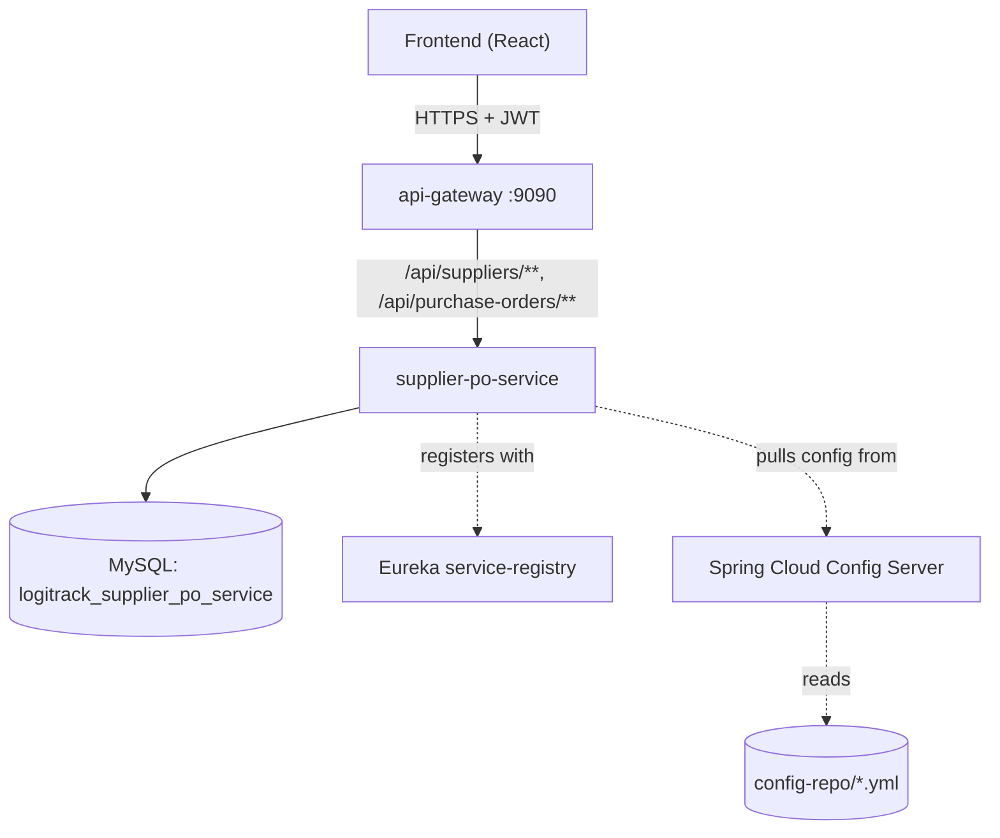
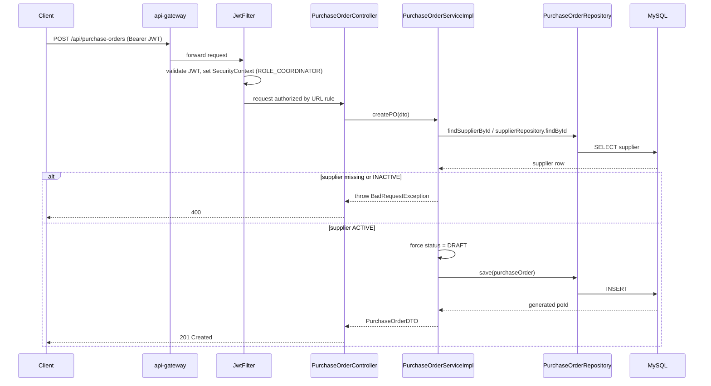
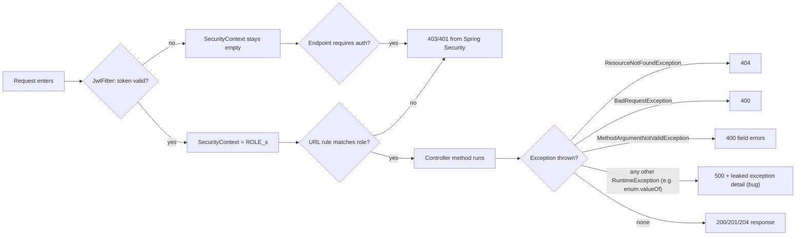

# supplier-po-service — Technical Documentation

> Part of the **Logi Track** logistics platform. Java 21, Spring Boot 3, Spring Cloud (Eureka + Config Server + Gateway), MySQL, JWT auth (HS256), REST. No message broker, no cache layer are used anywhere in this platform (confirmed by repo-wide search — deployment is manual/VM-style, no Docker/Kubernetes manifests found).

---

## A. Executive Summary

**30-second version:** This service is the system of record for **Suppliers** (vendors who ship goods to warehouses) and **Purchase Orders** (POs — the documents that authorize buying stock from a supplier). It lets coordinators register suppliers, place purchase orders against them, and track a PO's lifecycle from `DRAFT` to `RECEIVED` or `CANCELLED`.

**2-minute version:** `supplier-po-service` exposes two REST resource families — `/api/suppliers` and `/api/purchase-orders` — both gated to `ADMIN`/`COORDINATOR` roles via a shared JWT. Suppliers carry a soft-delete `status` (`ACTIVE`/`INACTIVE`); a purchase order can only be created against an `ACTIVE` supplier (the one cross-entity business rule enforced in code). Every entity has a `status` enum with a hardcoded default on creation, and every "delete" is a soft delete (status flip), never a row removal. The service registers with Eureka, pulls its config from a Spring Cloud Config Server backed by a local `config-repo`, and is fronted by an API Gateway that routes `/api/suppliers/**` and `/api/purchase-orders/**` here. Despite declaring OpenFeign and Resilience4j dependencies, **it makes zero outbound calls to other services** — the `warehouseId` on a PO is an unvalidated bare integer.

**Detailed technical explanation:** Two aggregates, `Supplier` and `PurchaseOrder` (a `@ManyToOne` from PO to Supplier), each with a Lombok `@Builder`-based JPA entity, a request/response DTO, a Spring Data repository, a service interface + impl, and a `@RestController`. Security is centralized in one `SecurityConfig` (URL-pattern authorization, no method-level `@PreAuthorize`), backed by a custom `JwtFilter` that parses and validates a Bearer token and populates the `SecurityContext` with a single `ROLE_<role>` authority. A shared `GlobalExceptionHandler` maps `ResourceNotFoundException`→404, `BadRequestException`→400, bean-validation failures→400, and everything else→500 (with a caveat — see §I).

**Business explanation:** When a warehouse needs more stock, a coordinator raises a Purchase Order against a registered Supplier. The service prevents ordering from a supplier that's been deactivated, tracks how much was ordered and when it's expected, and lets the PO's status be updated as goods are placed, partially received, fully received, or cancelled. Deactivating a supplier is reversible (soft delete) so historical POs against them remain intact.

---

## B. Business Context

**Business capability:** Vendor management + procurement document tracking for the logistics platform's inbound supply chain.

**Actors:** `ADMIN`, `COORDINATOR` (only these two roles can touch this service's endpoints — enforced at the URL level in `SecurityConfig`).

**Upstream systems:** None call into this service via Feign (it's not consumed programmatically by other microservices in this codebase, based on the research pass — it is reached only through the API Gateway from the frontend).

**Downstream systems:** None — despite `spring-cloud-starter-openfeign` and `spring-cloud-starter-circuitbreaker-resilience4j` being declared dependencies and a Resilience4j circuit-breaker block being pre-configured in `config-repo/supplier-po-service.yml`, **no `@FeignClient` interface exists in this module**. The `warehouseId` field on a Purchase Order is never validated against `warehouse-inventory-service`.

**Business impact if unavailable:** New suppliers can't be onboarded and new purchase orders can't be raised or progressed — inbound procurement stalls. Existing data remains readable/writable by other services (e.g. warehouse-inventory-service is independent), but nothing can create/modify Suppliers or POs.

### Use case: Register a supplier
1. **Actor:** COORDINATOR or ADMIN.
2. **Trigger:** `POST /api/suppliers`.
3. **Preconditions:** Caller holds a valid JWT with role ADMIN or COORDINATOR.
4. **Main flow:** Submit name (required), optional category/contact/lead-time. Service ignores any client-supplied `status` and forces `ACTIVE`. Row is inserted, DTO returned with `201 Created`.
5. **Alternative flow:** None.
6. **Failure flow:** Missing `name` → `400` (bean validation). Invalid/expired JWT → `401`/`403`.
7. **Business result:** A new sourcing option becomes available for purchase orders.
8. **Data created:** One row in `suppliers`, `status = ACTIVE`.
9. **Events emitted:** None (no broker).
10. **Audit implications:** None — this service does not write audit logs (that lives in identity-access-service, for user actions only).

### Use case: Raise a purchase order
1. **Actor:** COORDINATOR or ADMIN.
2. **Trigger:** `POST /api/purchase-orders`.
3. **Preconditions:** `supplierId` must reference an existing, `ACTIVE` supplier.
4. **Main flow:** Service looks up the supplier; if found and `ACTIVE`, builds the PO with `status` forced to `DRAFT` (ignoring any client-supplied status), persists, returns `201`.
5. **Alternative flow:** None (no draft-save/submit-for-approval distinction beyond the status field itself).
6. **Failure flow:** `supplierId` not found → `400 BadRequestException` ("supplier not found" style message). Supplier found but `INACTIVE` → `400` ("cannot create purchase order for an inactive supplier"). Missing `supplierId` → `400` bean validation.
7. **Business result:** A procurement record exists that downstream (manual) warehouse receiving processes reference — **note: no automatic linkage to warehouse-inventory-service exists in code**.
8. **Data created:** One row in `purchase_orders`, `status = DRAFT`.
9. **Events emitted:** None.
10. **Audit implications:** None captured by this service.

### Use case: Progress or cancel a purchase order
1. **Actor:** COORDINATOR or ADMIN.
2. **Trigger:** `PATCH /api/purchase-orders/{id}/status?status=PLACED|PARTIALLYRECEIVED|RECEIVED|CANCELLED`.
3. **Preconditions:** PO must exist.
4. **Main flow:** Status is set to whatever value is supplied — **no state-machine validation** (you can jump `DRAFT`→`RECEIVED` or `CANCELLED`→`PLACED` with no guard).
5. **Failure flow:** PO not found → `404`. Invalid enum string (e.g. `?status=FOO`) → **uncaught `IllegalArgumentException`, surfaces as an unhelpful `500`, not a `400`** (a genuine bug — see §I).
6. **Business result:** Reflects real-world PO progress, but the system does not protect against invalid/nonsensical transitions — this is trusted entirely to the caller.

---

## C. Repository Structure (annotated)

```
supplier-po-service/
├── pom.xml                          # Maven build: Spring Boot 3, Spring Cloud (Eureka client,
│                                     #  Config client, OpenFeign, Resilience4j — declared but unused),
│                                     #  Spring Data JPA, MySQL driver, Spring Security, JJWT, Lombok, Validation
└── src/main/java/com/cognizant/logitrack/
    ├── SupplierPoServiceApplication.java   # @SpringBootApplication + @EnableFeignClients (unused), entry point
    ├── entity/
    │   ├── Supplier.java                   # JPA entity — runs at request time (persistence layer)
    │   └── PurchaseOrder.java              # JPA entity, @ManyToOne -> Supplier
    ├── enums/
    │   ├── SupplierStatus.java             # ACTIVE, INACTIVE
    │   ├── POStatus.java                   # DRAFT, PLACED, PARTIALLYRECEIVED, RECEIVED, CANCELLED
    │   └── Role.java                       # shared platform role enum (SHIPPER..ADMIN)
    ├── dto/
    │   ├── SupplierDTO.java                # request/response shape for Supplier
    │   └── PurchaseOrderDTO.java           # request/response shape for PurchaseOrder
    ├── controller/
    │   ├── SupplierController.java         # /api/suppliers — HTTP entry point, request time
    │   └── PurchaseOrderController.java    # /api/purchase-orders
    ├── service/
    │   ├── SupplierService.java            # interface — defines the business contract
    │   └── PurchaseOrderService.java
    ├── serviceImplementation/
    │   ├── SupplierServiceImpl.java        # business logic + soft-delete + creation defaults
    │   └── PurchaseOrderServiceImpl.java   # business logic + supplier-active check
    ├── repository/
    │   ├── SupplierRepository.java         # Spring Data JPA — findByStatus/findByCategory (both unused)
    │   └── PurchaseOrderRepository.java    # findBySupplier_SupplierId, findByWarehouseId, findByStatus (unused)
    ├── exception/
    │   ├── ResourceNotFoundException.java  # -> 404
    │   ├── BadRequestException.java        # -> 400
    │   └── GlobalExceptionHandler.java     # @RestControllerAdvice, runs on every request that throws
    ├── config/
    │   └── SecurityConfig.java             # filter chain, runs once at startup to build the chain,
    │                                        #  then per-request as filters execute
    └── security/
        ├── JwtFilter.java                  # OncePerRequestFilter — runs on every incoming request
        └── JwtUtil.java                    # token generation/validation helper (generation unused here —
                                             #  this service never issues tokens, only validates them)
```

Config for this service is **not** in its own `src/main/resources/application.yml` beyond bootstrapping — the real values (datasource, JWT secret/expiration, Eureka URL, Resilience4j defaults) live in `config-repo/supplier-po-service.yml`, fetched at startup from the Config Server.

---

## D. Architecture

**Style:** Layered monolith-per-service (Controller → Service → Repository → Entity), one of ~8 business microservices behind a shared API Gateway, registered in a shared Eureka registry, configured from a shared Config Server. No event-driven components.

**Dependency direction:** `controller → service → repository → entity`, all pointing "inward" toward the domain; `security`/`config`/`exception` are cross-cutting, wired in by Spring at startup.







---

## E. Startup & Runtime Lifecycle

1. JVM starts, Spring Boot's `SpringApplication.run(SupplierPoServiceApplication.class, args)` executes (framework-generated bootstrap).
2. `spring.config.import: configserver:http://localhost:8888` (in local `application.yml`) makes Spring Cloud Config Client fetch `config-repo/supplier-po-service.yml` (+ `application.yml` shared defaults) from the Config Server **before** the rest of the context loads — this is why datasource/JWT/Eureka properties can live outside this module's jar.
3. Spring component-scans `com.cognizant.logitrack` for `@RestController`, `@Service`, `@Repository`, `@Configuration` beans (framework behavior — developer only writes the annotations).
4. Hibernate/JPA initializes the `EntityManagerFactory`; `ddl-auto: update` (from config-repo) means Hibernate will alter/create tables to match entities at this point — **not a real migration tool**, no Flyway/Liquibase present anywhere in the platform.
5. `SecurityConfig.securityFilterChain` bean is built, registering `JwtFilter` before `UsernamePasswordAuthenticationFilter` — this filter chain is fixed for the life of the application, not per-request.
6. Eureka client registers this instance (`spring-cloud-starter-netflix-eureka-client`) with the registry so the API Gateway (and any Feign-aware caller) can discover it — this is entirely framework/library behavior, no custom registration code exists.
7. Embedded Tomcat starts listening on the configured port; the application reaches "ready" state (Spring Boot Actuator, if enabled, would expose `/actuator/health` at this point — not verified as present/absent in this pass).
8. Graceful shutdown: standard Spring Boot behavior (SIGTERM triggers context close, connection pool drains) — no custom shutdown hooks were found.

---

## F. API Documentation

### `POST /api/suppliers`
- **Purpose / business operation:** Register a new supplier.
- **Auth:** JWT required. **Authorization:** `ADMIN` or `COORDINATOR` (URL rule in `SecurityConfig`).
- **Request body (`SupplierDTO`):** `name` (string, **required**), `category` (string, optional), `contactDetails` (string, optional), `leadTimeDays` (integer, optional), `status` (ignored on create).
- **Validation:** `name` `@NotBlank`; nothing else validated.
- **Response:** `201 Created`, body = created `SupplierDTO` (with generated `supplierId`, `status` always `ACTIVE`).
- **Failure statuses:** `400` (validation), `401`/`403` (auth).
- **Controller → Service → Repository:** `SupplierController.addSupplier` → `SupplierServiceImpl.addSupplier` → `SupplierRepository.save`.
- **DB tables affected:** `suppliers` (insert).
- **Transaction:** single insert, implicit transaction via Spring Data.
- **Idempotency:** not idempotent — repeated calls create duplicate suppliers (no unique constraint on `name`).

```json
// Sample request
{ "name": "Acme Freight Supplies", "category": "Packaging", "leadTimeDays": 5 }

// Sample response (201)
{ "supplierId": 42, "name": "Acme Freight Supplies", "category": "Packaging",
  "contactDetails": null, "leadTimeDays": 5, "status": "ACTIVE" }
```

### `GET /api/suppliers`
Returns **all** suppliers, including `INACTIVE` ones (no filter applied). Auth: `ADMIN`/`COORDINATOR`.

### `GET /api/suppliers/{id}`
Returns one supplier or `404` if not found.

### `PATCH /api/suppliers/{id}?status=ACTIVE|INACTIVE`
Sets the supplier's status. **Bug:** an invalid `status` value throws an uncaught `IllegalArgumentException` from `SupplierStatus.valueOf`, which the generic exception handler turns into a `500` instead of a `400`.

### `DELETE /api/suppliers/{id}`
**Soft delete** — sets `status = INACTIVE`, does not remove the row. Returns `204 No Content`. No check for open purchase orders against this supplier before deactivating.

### `POST /api/purchase-orders`
- **Purpose:** Raise a purchase order against an active supplier.
- **Auth:** `ADMIN`/`COORDINATOR`.
- **Request body (`PurchaseOrderDTO`):** `supplierId` (**required**, `@NotNull`), `warehouseId` (int, unvalidated), `lineItems` (free-text string, unvalidated — **not a structured line-item model**), `totalValue` (`BigDecimal`, unvalidated — can be negative/null), `orderDate`/`expectedDelivery` (dates, unvalidated, no ordering check), `status` (ignored on create).
- **Business rule enforced:** referenced supplier must exist and be `ACTIVE`, else `400`.
- **Response:** `201`, body = created PO with `status = DRAFT`.
- **DB tables affected:** `purchase_orders` (insert), reads `suppliers`.

```json
// Sample request
{ "supplierId": 42, "warehouseId": 3, "lineItems": "10x Pallet wrap, 5x Strapping kit",
  "totalValue": 1250.00, "orderDate": "2026-07-28", "expectedDelivery": "2026-08-05" }

// Sample response (201)
{ "poId": 501, "supplierId": 42, "warehouseId": 3, "lineItems": "10x Pallet wrap, 5x Strapping kit",
  "totalValue": 1250.00, "orderDate": "2026-07-28", "expectedDelivery": "2026-08-05", "status": "DRAFT" }
```

### `GET /api/purchase-orders?supplierId=&warehouseId=`
**Important:** at least one of `supplierId`/`warehouseId` must be supplied — if **neither** is given, the endpoint silently returns `[]` rather than "all POs" or a `400`. There is no "list all purchase orders" endpoint.

### `GET /api/purchase-orders/{id}`
Returns one PO or `404`.

### `PATCH /api/purchase-orders/{id}/status?status=...`
Sets PO status to any `POStatus` value with **no transition-rule enforcement** (any status → any status is accepted). Same `enum.valueOf` 500-instead-of-400 bug as the supplier status endpoint.

---

## G. End-to-End Request Flow — `POST /api/purchase-orders`

1. **Frontend → Gateway:** Request hits `api-gateway` on port 9090, matched by the `Path=/api/purchase-orders/**` predicate, forwarded to `supplier-po-service` (resolved via Eureka).
2. **JwtFilter:** Extracts `Authorization: Bearer <token>`, calls `JwtUtil.validateToken`; on success, extracts `email` (subject) + `role` claim, sets a `UsernamePasswordAuthenticationToken` with authority `ROLE_<role>` into `SecurityContextHolder`.
3. **Authorization:** `SecurityConfig`'s URL rule requires `ROLE_ADMIN` or `ROLE_COORDINATOR`; anything else → `403`.
4. **Deserialization:** Spring MVC binds the JSON body to `PurchaseOrderDTO` via Jackson.
5. **Validation:** `@Valid` triggers Bean Validation; only `supplierId` is checked (`@NotNull`) — a missing value throws `MethodArgumentNotValidException` → `400` via `GlobalExceptionHandler`.
6. **Controller:** `PurchaseOrderController.createPO` calls `purchaseOrderService.createPO(dto)`.
7. **Service:** `PurchaseOrderServiceImpl.createPO` loads the `Supplier` by `dto.getSupplierId()`; throws `BadRequestException` if missing or not `ACTIVE`.
8. **Mapping:** builds a `PurchaseOrder` entity from the DTO fields, forcing `status = DRAFT`.
9. **Repository/DB:** `purchaseOrderRepository.save(...)` issues an `INSERT INTO purchase_orders (...)`, implicit transaction commits on success.
10. **Response mapping:** entity mapped back to `PurchaseOrderDTO`, serialized to JSON by Jackson.
11. **Status code:** `201 Created`.
12. **Failure branches:** supplier not found/inactive → `400`; validation failure → `400`; unexpected exception → `500` (with leaked exception detail — see §I).

---

## H. File-by-File Documentation

### `entity/Supplier.java`
- **Responsibility:** JPA entity mapping to the `suppliers` table.
- **Layer:** Domain/persistence.
- **Fields:** `supplierId` (PK, identity), `name`, `category`, `contactDetails` (`TEXT` column), `leadTimeDays`, `status` (`SupplierStatus`, defaults to `ACTIVE` via `@Builder.Default`).
- **Annotations:** `@Entity`, `@Table(name="suppliers")`, `@Data @Builder @NoArgsConstructor @AllArgsConstructor` (Lombok — generates getters/setters/builder/constructors at compile time; removing Lombok would break every call site using `.builder()` or generated getters).
- **Thread-safety:** mutable POJO, not thread-safe by design — JPA entities are expected to be scoped to a single request/transaction.

### `entity/PurchaseOrder.java`
- Same Lombok pattern. **Key relationship:** `@ManyToOne @JoinColumn(name="SupplierID") Supplier supplier` — this is the only real relational link in the module; `warehouseId` is a bare `Integer`, not a JPA relationship (because the warehouse lives in a different service's database — cross-service references are always plain IDs in this platform, never foreign keys across service boundaries).
- **Notable gap:** `lineItems` is a raw `TEXT` string — there is no `PurchaseOrderLineItem` entity, so quantities/SKUs are unstructured and `totalValue` has no computed relationship to them.

### `controller/SupplierController.java` / `PurchaseOrderController.java`
- **Responsibility:** HTTP boundary — method/path mapping, delegates immediately to the service layer, no business logic here.
- **Caller:** Spring MVC's `DispatcherServlet` (framework-invoked per request).
- **Key methods:** see §F for full endpoint-by-endpoint behavior.

### `serviceImplementation/SupplierServiceImpl.java`
- **Responsibility:** business rules for Supplier.
- **Key methods:**
  - `addSupplier(dto)` — ignores `dto.getStatus()`, always sets `ACTIVE`.
  - `getAllSuppliers()` — unfiltered.
  - `updateStatus(id, status)` — no transition guard.
  - `deleteSupplier(id)` — soft delete only (`status = INACTIVE`), no cascade check against open POs.

### `serviceImplementation/PurchaseOrderServiceImpl.java`
- **Responsibility:** business rules for PurchaseOrder.
- **Key methods:**
  - `createPO(dto)` — looks up supplier, enforces `ACTIVE` supplier rule, forces `status = DRAFT`.
  - `getPOsBySupplier` / `getPOsByWarehouse` — plain repository delegation.
  - `updatePOStatus(id, status)` — **no state-machine enforcement** (any→any transition accepted).

### `repository/SupplierRepository.java` / `PurchaseOrderRepository.java`
- Spring Data JPA interfaces; several declared query methods (`SupplierRepository.findByStatus`, `findByCategory`; `PurchaseOrderRepository.findByStatus`) are **never called anywhere** — dead code, harmless but worth pruning.

### `exception/GlobalExceptionHandler.java`
- `@RestControllerAdvice` — maps `ResourceNotFoundException`→404, `BadRequestException`→400, `MethodArgumentNotValidException`→400 (field-level errors), any other `Exception`→500 **with `ex.getClass().getSimpleName() + ": " + ex.getMessage()` in the response body** — an information-disclosure smell, and the catch-all is what turns invalid-enum-string requests into misleading 500s instead of 400s.

### `config/SecurityConfig.java` + `security/JwtFilter.java` + `security/JwtUtil.java`
- **SecurityConfig:** stateless session, CSRF disabled, CORS via a shared config source, URL-pattern authorization only (`@EnableMethodSecurity` is declared but **no `@PreAuthorize` is used anywhere** — dead annotation).
- **JwtFilter:** `OncePerRequestFilter`, runs on every request, parses Bearer token, sets `SecurityContext` on success, silently lets unauthenticated requests fall through to be rejected by the URL rules (does not itself return 401).
- **JwtUtil:** HS256 signing, secret/expiration sourced from `config-repo/supplier-po-service.yml` (`jwt.secret`, `jwt.expiration`) — **the secret is a plaintext hex string committed to the config repo**, a genuine secret-management gap (shared across all services, see the master architecture doc).

---

## I. Production-Readiness Review

| Dimension | Finding |
|---|---|
| **Security** | JWT secret hardcoded in plaintext in `config-repo` (not vaulted). No method-level authorization (URL-only). No ownership checks needed here (no user-scoped data), but no rate-limiting/lockout on any endpoint. |
| **Reliability** | No circuit breaker actually wired despite Resilience4j being configured — moot since no outbound calls exist. `ddl-auto: update` is risky for production schema management (no Flyway/Liquibase). |
| **Correctness bugs** | Unguarded `enum.valueOf(status)` in both `PATCH` endpoints turns bad client input into a `500` instead of a `400`. No PO status state-machine — any transition is accepted. Client-supplied `status` on create is silently discarded (confusing but not unsafe). |
| **Performance** | No pagination on `GET /api/suppliers` or PO list endpoints — fine at current scale, a risk at growth. |
| **Observability** | Only `log.info` statements found; no metrics/tracing wiring confirmed in this module. |
| **Testing** | No test files were located for this module in this research pass. |
| **Maintainability** | Dead repository methods and an unused Feign/Resilience4j dependency footprint (declared, never used) — worth removing or actually wiring up the `warehouseId` validation against warehouse-inventory-service. |

---

## J. Interview Preparation

**Q: How does this service prevent creating a PO against a bad supplier?**
A: `PurchaseOrderServiceImpl.createPO` loads the `Supplier` by ID before persisting the PO; if it's missing or its `status` isn't `ACTIVE`, it throws a `BadRequestException`, which `GlobalExceptionHandler` maps to a `400`. This is the one cross-entity business rule enforced in the module.

**Q: Why is "delete" not really deleting anything?**
A: Both `Supplier` and future soft-deletable entities use a `status` enum instead of a hard `DELETE FROM` — `deleteSupplier` just flips `status` to `INACTIVE` and saves. This preserves referential history (e.g. old POs still show a meaningful supplier) and lets the action be reversed via the same `PATCH .../status` endpoint used for activation.

**Q: What's the biggest correctness gap you'd fix first?**
A: The unguarded `enum.valueOf()` calls in both status-update endpoints — an invalid status string should be a client-facing `400`, not a `500` that also leaks the exception class name. I'd wrap the parse and translate `IllegalArgumentException` into `BadRequestException` explicitly, and add a real state-machine check for PO status transitions.

**Q: Why does the pom.xml declare Feign and Resilience4j if they're unused?**
A: Likely a shared parent/starter template applied uniformly across all microservices in this platform (several other services show the same pattern) — the dependency exists but no `@FeignClient` interface was ever added here because this service doesn't need to call anyone else. It's dead weight, not a bug, but worth pruning or completing (e.g. validating `warehouseId` against warehouse-inventory-service).
