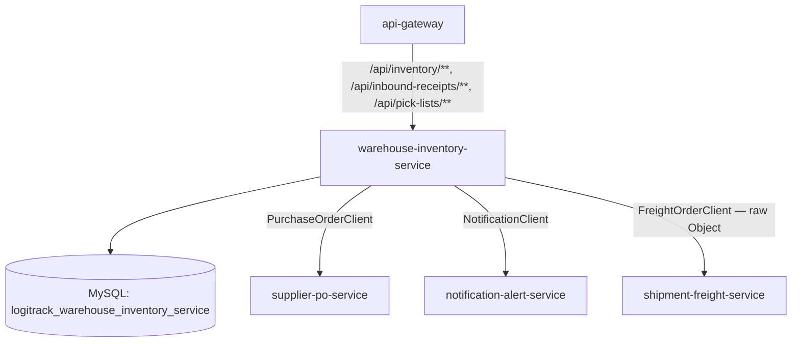
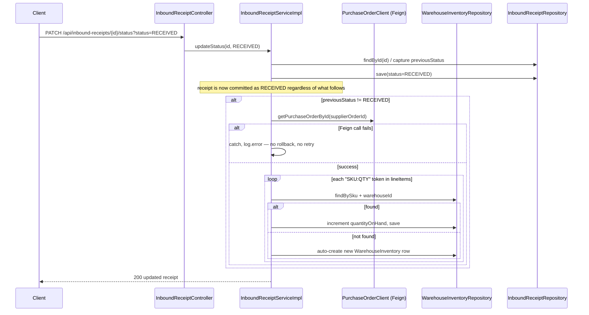
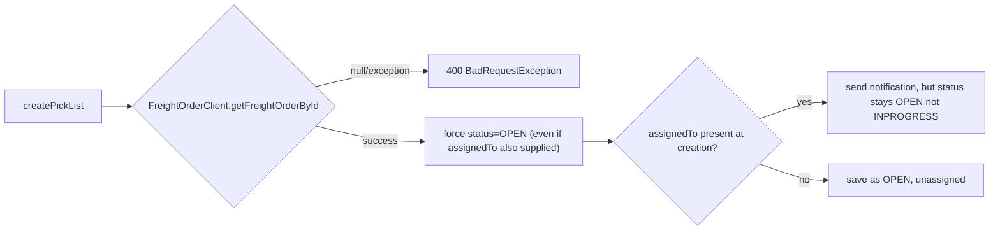

# warehouse-inventory-service — Technical Documentation

> Java 17, Spring Boot 3.2.3, MySQL, JWT-secured REST. Owns **Warehouses** (physical stocking locations), **Warehouse Inventory** (stock levels), **Inbound Receipts** (goods arriving from a PO), and **Pick Lists** (outbound picking work orders).

> **Update:** A `Warehouse` entity now backs the `warehouseId` used across the platform. It is read-only over the API (`GET /api/warehouses`, `GET /api/warehouses/{id}`) and seeded with 10 sample warehouses on first startup (`config/WarehouseSeeder`), since warehouse management itself is out of scope. `warehouseId` on inbound-receipt and pick-list creation is now validated to reference a real warehouse (400 if not), and `supplier-po-service` validates a PO's `warehouseId` against this service over Feign.

---

## A. Executive Summary

**30-second version:** This service tracks how much stock is on-hand and reserved per SKU per warehouse, records goods received against purchase orders (auto-incrementing inventory when a receipt is marked `RECEIVED`), and manages pick-list work orders for warehouse staff.

**2-minute version:** `WarehouseInventory` has **no status/lifecycle field at all** — just on-hand/reserved quantities and a `PATCH .../quantity` endpoint that **overwrites** the value (not an increment/decrement). A `reserveStock`/`releaseStock`/`consumeStock` service-layer trio exists with real business logic (insufficient-stock guards), but `reserveStock` and `releaseStock` are **never exposed by any controller endpoint** — dead/unreachable code. The one genuinely interesting flow is `InboundReceiptServiceImpl.updateStatus`: when a receipt transitions to `RECEIVED` (and wasn't already), it fetches the referenced purchase order via Feign, parses its free-text `lineItems` string (`"SKU:QTY,SKU:QTY"`) and either increments matching inventory rows or **auto-creates** new ones — all wrapped in a try/catch that only logs on failure, meaning **the receipt is already marked RECEIVED regardless of whether the inventory sync actually succeeded**.

**Detailed technical explanation:** Three flat entities (no child/line-item tables) — `WarehouseInventory`, `InboundReceipt` (`ReceiptStatus`: PENDING/RECEIVED/DISCREPANCY), `PickList` (`PickListStatus`: OPEN/INPROGRESS/COMPLETED/ON_HOLD/SHORTAGE/CANCELLED). `PickListServiceImpl.createPickList` validates the referenced freight order exists via a Feign `FreightOrderClient` that **returns a raw `Object`** (not a typed DTO — a code smell), and can leave a pick list `assignedTo` a user while still `status=OPEN` (only `assignPickList` flips it to `INPROGRESS`) — an inconsistent state combination. Three outbound Feign clients exist (`PurchaseOrderClient`, `NotificationClient`, `FreightOrderClient`), none with a fallback factory — failures are caught ad hoc by each caller, with wildly inconsistent rigor (the pick-list notification failure path swallows exceptions with an **empty catch block**, not even logging).

**Business explanation:** When goods physically arrive at a warehouse against a purchase order, marking the receipt `RECEIVED` is what actually puts stock into the system (auto-creating a new inventory row if the SKU wasn't tracked yet). When an order needs to be fulfilled from the warehouse, a pick list tells staff what to pick and lets a supervisor assign/track it through to completion.

---

## B. Business Context

**Business capability:** Physical inventory tracking + inbound receiving + outbound pick-list management.

**Actors:** `WAREHOUSEOPS`, `ADMIN` (inventory + receipts); `WAREHOUSEOPS`, `COORDINATOR`, `ADMIN` (pick lists).

**Upstream systems:** None confirmed calling in via Feign.

**Downstream systems:** `supplier-po-service` (via `PurchaseOrderClient`, to fetch line items on receipt), `notification-alert-service` (via `NotificationClient`, on pick-list create/assign), `shipment-freight-service` (via `FreightOrderClient`, to validate a freight order exists before creating a pick list).

**Business impact if unavailable:** Inbound receiving and outbound picking both stall; inventory levels become stale (no other service was found to write to `WarehouseInventory`).

### Use case: Receive goods against a purchase order
1. **Actor:** WAREHOUSEOPS or ADMIN.
2. **Trigger:** `PATCH /api/inbound-receipts/{id}/status?status=RECEIVED`.
3. **Preconditions:** receipt exists; not already `RECEIVED` (idempotency guard against double-processing).
4. **Main flow:** status set and saved first; **then** (only if the transition is genuinely PENDING/DISCREPANCY→RECEIVED) the service calls `PurchaseOrderClient.getPurchaseOrderById`, parses `lineItems`, and for each SKU either increments existing inventory or creates a new row.
5. **Failure flow:** any exception in the Feign call or parsing is caught and logged — **the receipt status change is not rolled back**, so a downstream sync failure leaves the receipt showing `RECEIVED` with inventory potentially unsynced.
6. **Business result:** warehouse stock reflects the received goods (when the sync succeeds); a fragile string contract (`"SKU:QTY,SKU:QTY"`) between two independently-deployed services is the mechanism.

### Use case: Create and fulfill a pick list
1. **Actor:** WAREHOUSEOPS/COORDINATOR/ADMIN create; WAREHOUSEOPS actions the assignment.
2. **Trigger:** `POST /api/pick-lists`, then `PATCH .../assign`, then `PATCH .../status`.
3. **Main flow:** creation validates the freight order exists (Feign), forces `status=OPEN` regardless of whether `assignedTo` was also supplied at creation (a possible OPEN+assigned inconsistency); `assign` unconditionally sets `INPROGRESS` (even from a terminal state); `status` PATCH accepts any value with no transition rules.
4. **Business result:** warehouse staff have a trackable picking work order, but the state machine offers no real guardrails.

---

## C. Repository Structure (annotated)

```
warehouse-inventory-service/src/main/java/com/cognizant/logitrack/
├── entity/
│   ├── Warehouse.java               # warehouseId(PK), warehouseName, addressLine, city, state, country,
│   │                                 #  postalCode, contactNumber, status(WarehouseStatus ACTIVE default)
│   ├── WarehouseInventory.java      # NO status field — sku, productName, warehouseId, binLocation,
│   │                                 #  quantityOnHand, quantityReserved, lastUpdated (@UpdateTimestamp)
│   ├── InboundReceipt.java          # supplierOrderId, warehouseId, receivedDate, receivedBy, status(PENDING default)
│   └── PickList.java                # freightOrderId, warehouseId, assignedTo, status(OPEN default), createdDate
├── enums/
│   ├── ReceiptStatus.java           # PENDING, RECEIVED, DISCREPANCY
│   └── PickListStatus.java          # OPEN, INPROGRESS, COMPLETED, ON_HOLD, SHORTAGE, CANCELLED
├── dto/ (InventoryDTO — no validation at all; InboundReceiptDTO, PickListDTO — @NotNull on FK-ish fields only)
├── controller/
│   ├── InventoryController.java     # /api/inventory — GET, PATCH quantity, POST consume
│   ├── InboundReceiptController.java # /api/inbound-receipts — POST, GET, PATCH status
│   └── PickListController.java      # /api/pick-lists — POST, GET, GET assigned/{userId}, PATCH status, PATCH assign
├── service/ + serviceImplementation/
│   ├── InventoryService(Impl).java  # updateQuantity, reserveStock(unreachable), releaseStock(unreachable), consumeStock
│   ├── InboundReceiptService(Impl).java  # the PO-linked auto-restock logic
│   └── PickListService(Impl).java   # freight-order validation + notification side-effects
├── repository/ (WarehouseInventoryRepository, InboundReceiptRepository, PickListRepository — several unused query methods)
├── client/
│   ├── PurchaseOrderClient.java     # -> supplier-po-service, GET /api/purchase-orders/{id}
│   ├── NotificationClient.java      # -> notification-alert-service, POST /api/notifications
│   └── FreightOrderClient.java      # -> shipment-freight-service, GET /api/freight-orders/{id} — returns raw Object
├── exception/ (BadRequestException, ResourceNotFoundException, GlobalExceptionHandler)
└── config/SecurityConfig.java + security/JwtFilter.java, JwtUtil.java
```

Config: `config-repo/warehouse-inventory-service.yml` — port `8083`, MySQL `logitrack_warehouse_inventory_service`, Eureka, JWT secret/expiration, Resilience4j default instance (unused — none of the three Feign clients has a `@CircuitBreaker`/fallback).

---

## D. Architecture







---

## E. Startup & Runtime Lifecycle

Standard platform pattern — see `infrastructure.md` §E. No service-specific startup behavior beyond the standard config-fetch → Hibernate DDL → Eureka registration sequence.

---

## F. API Documentation

### `GET /api/warehouses` / `GET /api/warehouses/{id}` — WAREHOUSEOPS/COORDINATOR/ADMIN
Read-only list/lookup of seeded warehouses. Used by pickers/receivers and by `supplier-po-service` (over Feign) to validate a PO's `warehouseId`. `404` if the id does not exist. There are no create/update/delete endpoints — warehouse data is seeded (`WarehouseSeeder`, 10 rows, only when the table is empty).

### `GET /api/inventory?warehouseId=` / `GET /api/inventory/{id}` — WAREHOUSEOPS/ADMIN
Plain reads, no filtering beyond warehouse.

### `PATCH /api/inventory/{id}/quantity?quantity=` — WAREHOUSEOPS/ADMIN
**Overwrites** `quantityOnHand` directly — not a delta. No floor check (can be set negative), no cross-check against `quantityReserved`.

### `POST /api/inventory/{id}/reserve?quantity=` / `POST /api/inventory/{id}/release?quantity=` — WAREHOUSEOPS/ADMIN
`reserve` moves stock `on-hand → reserved` (guards `on-hand >= quantity`); `release` moves it back `reserved → on-hand` (guards `reserved >= quantity`). These make `quantityReserved` editable (previously the service logic existed but had no endpoint, so reserved was stuck at the value receipts set — `0`).

### `POST /api/inventory/{id}/consume?quantity=` — WAREHOUSEOPS/ADMIN
Retires physical stock that has left the warehouse. Draws from available **on-hand first**, then falls back to `reserved` for any remainder; guards against consuming more than total physical stock (`on-hand + reserved`) else `400`. **Consumption is intentionally not gated behind a prior reservation** — freshly received goods (all on-hand, `reserved = 0`) are consumable directly. (Previously consume decremented `reserved` only and required a reservation that no endpoint could create, so received stock could never be consumed.)

### `POST /api/inbound-receipts` — WAREHOUSEOPS/ADMIN
`InboundReceiptDTO`: `supplierOrderId` `@NotNull`, `warehouseId` `@NotNull`. `warehouseId` must reference an existing warehouse (`400 "Warehouse does not exist: {id}"` otherwise). Forces `status=PENDING` on create (ignores DTO's status). `201`.

### `GET /api/inbound-receipts?warehouseId=`

### `PATCH /api/inbound-receipts/{id}/status?status=` — WAREHOUSEOPS/ADMIN
See §D sequence diagram for the RECEIVED-transition auto-restock logic. **Bug:** invalid status string → uncaught `IllegalArgumentException` → `500` instead of `400`.

```json
// Sample request/response for the status transition
// PATCH /api/inbound-receipts/42/status?status=RECEIVED
{ "receiptId": 42, "supplierOrderId": 501, "warehouseId": 3,
  "receivedDate": "2026-07-28", "receivedBy": 9, "status": "RECEIVED" }
```

### `POST /api/pick-lists` — WAREHOUSEOPS/COORDINATOR/ADMIN
`PickListDTO`: `freightOrderId` `@NotNull`, `warehouseId` `@NotNull`. Validates freight order exists via Feign (raw `Object` return, null-checked only) and that `warehouseId` references an existing warehouse (`400 "Warehouse does not exist: {id}"` otherwise). Forces `status=OPEN`.

### `GET /api/pick-lists?warehouseId=` / `GET /api/pick-lists/assigned/{userId}` — WAREHOUSEOPS/COORDINATOR/ADMIN

### `PATCH /api/pick-lists/{id}/status?status=` — same roles
No transition validation — any status to any status.

### `PATCH /api/pick-lists/{id}/assign?assignedTo=` — same roles
Unconditionally sets `assignedTo` and forces `status=INPROGRESS`, regardless of current status (including from a terminal state like `COMPLETED`).

---

## G. End-to-End Request Flow — `PATCH /api/inbound-receipts/{id}/status?status=RECEIVED`

1. Request enters via gateway, `/api/inbound-receipts/**` predicate.
2. `JwtFilter` validates token; `SecurityConfig` requires `WAREHOUSEOPS` or `ADMIN`.
3. `InboundReceiptController.updateStatus` parses `status` via `ReceiptStatus.valueOf` (unguarded — bad input here throws uncaught).
4. `InboundReceiptServiceImpl.updateStatus`: loads receipt (404 if missing), captures `previousStatus`, sets new status, **saves immediately** — this commit happens before any downstream sync is attempted.
5. If `status==RECEIVED && previousStatus!=RECEIVED`: calls `PurchaseOrderClient.getPurchaseOrderById(supplierOrderId)`.
6. Parses `lineItems` (`split(",")` then `split("[:\-]")`, expects exactly 2 tokens per item) — malformed entries are silently skipped.
7. For each valid SKU/qty pair: look up existing `WarehouseInventory` by SKU+warehouseId; increment if found, auto-create (`productName="Product "+sku`, `binLocation="RECEIVING"`, `quantityReserved=0`) if not.
8. Any exception in steps 5–7 is caught and logged — **does not roll back step 4's already-committed status change.**
9. Response returns the updated receipt, `200 OK`, regardless of whether the inventory sync succeeded.
10. **Failure branches:** receipt not found → `404`; invalid status string → `500` (bug); Feign/parsing failure → silently logged, receipt still shows `RECEIVED`.

---

## H. File-by-File Documentation (key files)

### `entity/WarehouseInventory.java`
Confirmed: **no status/active field whatsoever.** Fields: `sku` (`@Column(length=50)`), `productName`, `warehouseId`, `binLocation`, `quantityOnHand`, `quantityReserved`, `lastUpdated` (`@UpdateTimestamp`). No relationships.

### `serviceImplementation/InventoryServiceImpl.java`
`updateQuantity` — raw overwrite, no delta semantics. `reserveStock`/`releaseStock` — real, guarded logic (insufficient-stock checks), now reachable via `POST .../reserve` and `.../release`. `consumeStock` — draws from on-hand first then falls back to reserved, guarding against consuming more than total physical stock; no longer requires a prior reservation.

### `serviceImplementation/InboundReceiptServiceImpl.java`
`createReceipt` forces `PENDING`. `updateStatus` contains the fragile PO-line-item-parsing auto-restock logic described above — the receipt commit is **not transactional with** the inventory sync (two separate concerns, no compensating action on partial failure).

### `serviceImplementation/PickListServiceImpl.java`
`createPickList` — Feign existence-check against a **raw `Object`** return type (weak typing; `dto/FreightOrderDTO.java` exists in this module but is unused for this call), conflates "not found" and "service down" into the same `BadRequestException` message. `sendNotification` — **empty catch block**, failures are completely invisible (no log line), unlike the receipt service's `log.error` pattern.

### `client/FreightOrderClient.java`
`@FeignClient(name="shipment-freight-service", path="/api/freight-orders")` — `getFreightOrderById` returns `Object`, not a typed DTO. No fallback factory.

---

## I. Production-Readiness Review

| Dimension | Finding |
|---|---|
| **Data consistency** | The receipt-status commit and the inventory auto-restock are not atomic/transactional together — a Feign or parsing failure leaves the receipt `RECEIVED` with inventory un-synced, silently. |
| **Fragile integration contract** | `lineItems` string parsing (`"SKU:QTY,SKU:QTY"`) between two independently-deployed services with no schema/versioning — any format drift breaks silently (caught, logged, ignored). |
| **Dead/unreachable code** | `reserveStock`/`releaseStock` are now exposed via `POST .../reserve` and `.../release`. Several repository query methods (`findByWarehouseIdAndBinLocation`, `findByStatus` ×2, `findByFreightOrderId`) remain unused. |
| **Weak typing** | `FreightOrderClient.getFreightOrderById` returns `Object` despite a typed `FreightOrderDTO` existing in the same module. |
| **Silent failures** | `PickListServiceImpl.sendNotification`'s empty catch block hides notification-service outages entirely. |
| **Correctness bugs** | Unguarded `enum.valueOf` in both `InboundReceiptController.updateStatus` and `PickListController.updateStatus`. |
| **Inconsistent state** | A pick list can be created `assignedTo` a user while remaining `OPEN` (only `assign` sets `INPROGRESS`). |
| **Testing** | Two test files exist, each with exactly one trivial test — minimal coverage of the interesting business logic (reserve/consume boundaries, receipt auto-sync, pick-list transitions). |

---

## J. Interview Preparation

**Q: What happens if supplier-po-service is down when a receipt is marked RECEIVED?**
A: The receipt's status change is already committed to the database before the Feign call happens. If the call fails, the exception is caught and logged, but there's no rollback — the receipt shows `RECEIVED` while the warehouse inventory was never actually updated. This is a real data-consistency gap I'd want to fix with either a saga/compensating-transaction pattern or by making the whole operation transactional in a way that fails the status update too if the sync fails.

**Q: Why is `updateQuantity` an overwrite instead of an increment/decrement?**
A: As implemented, it's a blunt "set this exact value" operation — useful for manual corrections/audits, but semantically different from `reserveStock`/`consumeStock`'s careful add/subtract-with-guard logic. Since `reserveStock`/`releaseStock` aren't wired to any endpoint, `updateQuantity` is currently the *only* way any client can change `quantityOnHand` directly (aside from the receipt auto-restock), which conflates "correct a count" with "receive new stock" into one blunt tool.

**Q: How would you make the PO line-item parsing more robust?**
A: Replace the free-text `"SKU:QTY,SKU:QTY"` convention with a real structured line-item model shared (or versioned) between `supplier-po-service` and this service — ideally a proper DTO with a list of typed line items rather than a string both sides have to agree on informally.
